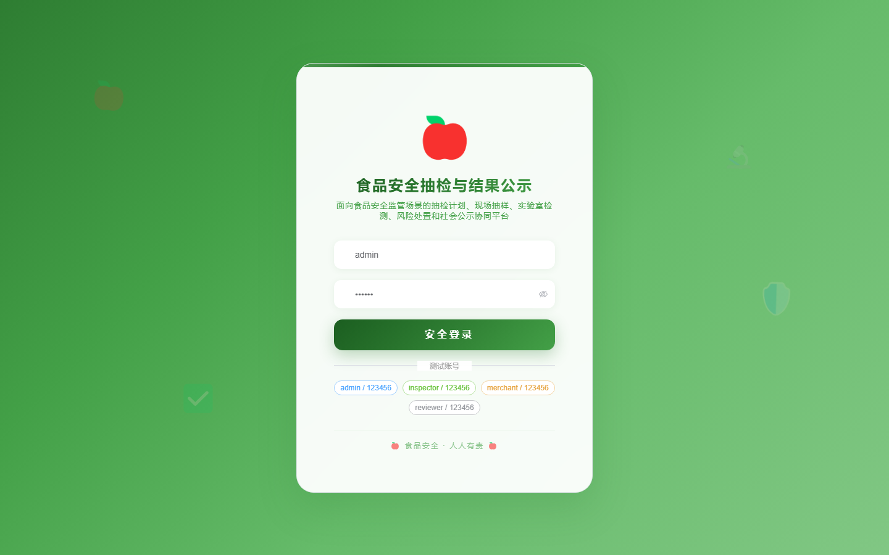
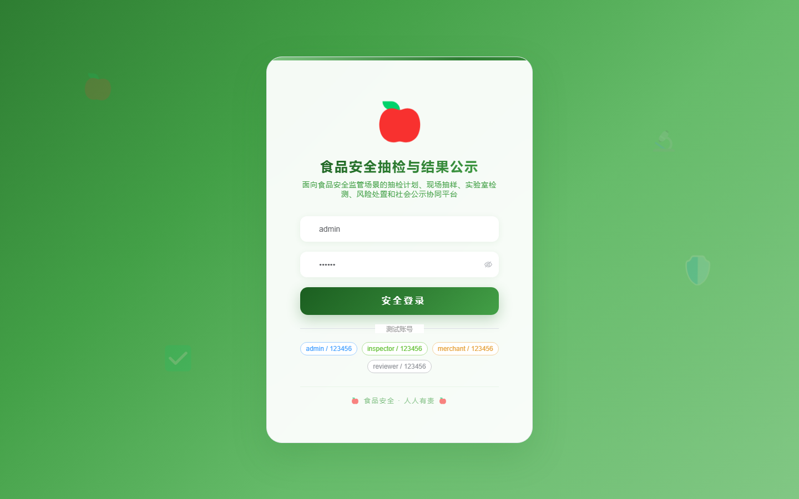

# 146 - 食品安全抽检任务与结果公示平台

## 项目信息

- 项目编号：`146`
- 组件类型：`backend, frontend`
- 后端入口：`http://127.0.0.1:8146`
- 前端入口：`http://127.0.0.1:3146`
- 账号来源：未识别
- 已收录截图：`17` 张

## 默认账号

- 暂未自动识别到默认账号

## 预览截图

### guest

#### guest-01-dashboard

#### guest-01-login

#### guest-02-register

#### guest-02-user

#### guest-03-plan

#### guest-04-food

#### guest-05-merchant

#### guest-06-task

#### guest-07-agency

#### guest-08-sample

#### guest-09-result

#### guest-10-recheck

#### guest-11-disposal

#### guest-12-report

#### guest-13-warning

#### guest-14-notice

#### guest-15-log

