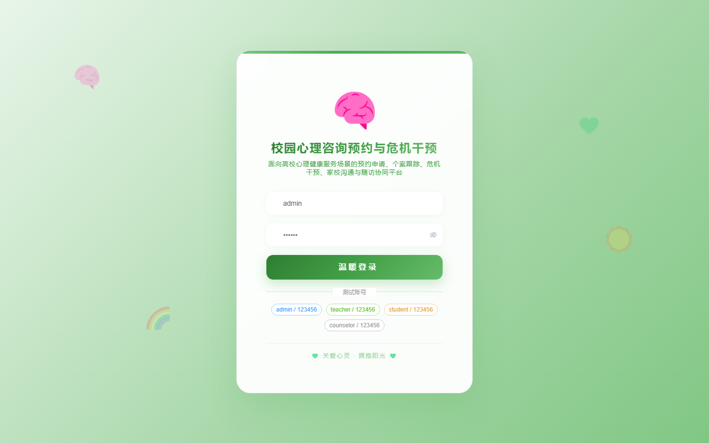
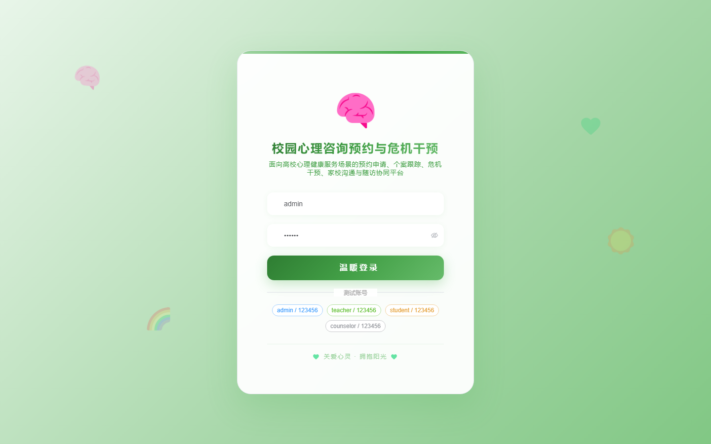
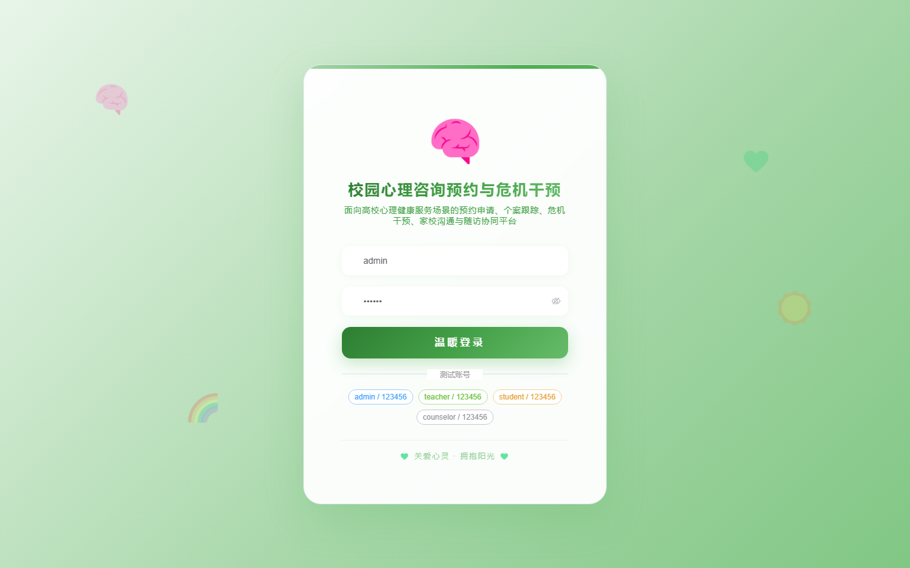

# 147 - 校园心理咨询预约与危机干预管理系统

## 项目信息

- 项目编号：`147`
- 组件类型：`backend, frontend`
- 后端入口：`http://127.0.0.1:8147`
- 前端入口：`http://127.0.0.1:3147`
- 账号来源：未识别
- 已收录截图：`17` 张

## 默认账号

- 暂未自动识别到默认账号

## 预览截图

### guest

#### guest-01-dashboard

#### guest-01-login

#### guest-02-register

#### guest-02-user

#### guest-03-case

#### guest-04-room

#### guest-05-student

#### guest-06-duty

#### guest-07-appointment

#### guest-08-record

#### guest-09-questionnaire

#### guest-10-risk

#### guest-11-intervention

#### guest-12-family

#### guest-13-followup

#### guest-14-notice

#### guest-15-log

