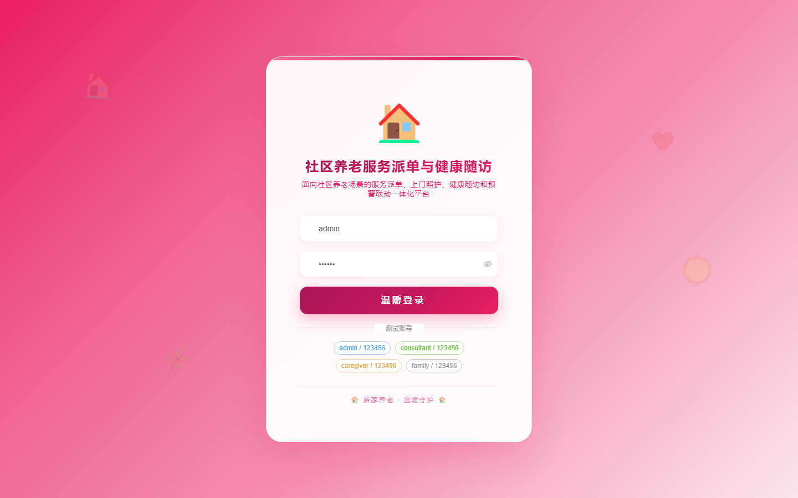

# 148 - 社区养老服务派单与健康随访管理系统

## 项目信息

- 项目编号：`148`
- 组件类型：`backend, frontend`
- 后端入口：`未启动`
- 前端入口：`未启动`
- 账号来源：未识别
- 已收录截图：`16` 张

## 默认账号

- 暂未自动识别到默认账号

## 预览截图

### guest

#### guest-01-login

#### guest-02-dashboard

#### guest-03-user

#### guest-04-package

#### guest-05-elder

#### guest-06-caregiver

#### guest-07-order

#### guest-08-team

#### guest-09-checkin

#### guest-10-record

#### guest-11-assessment

#### guest-12-reminder

#### guest-13-family

#### guest-14-alert

#### guest-15-notice

#### guest-16-log

