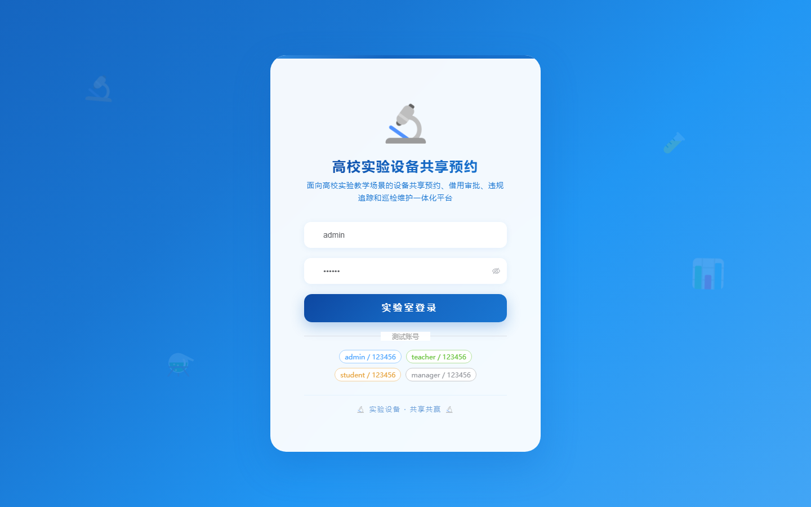
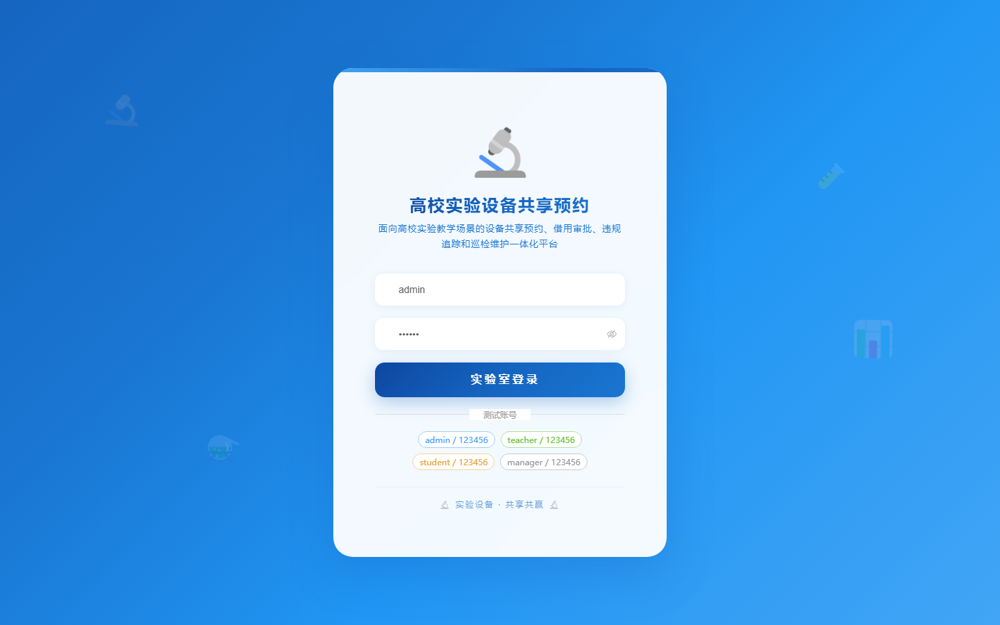
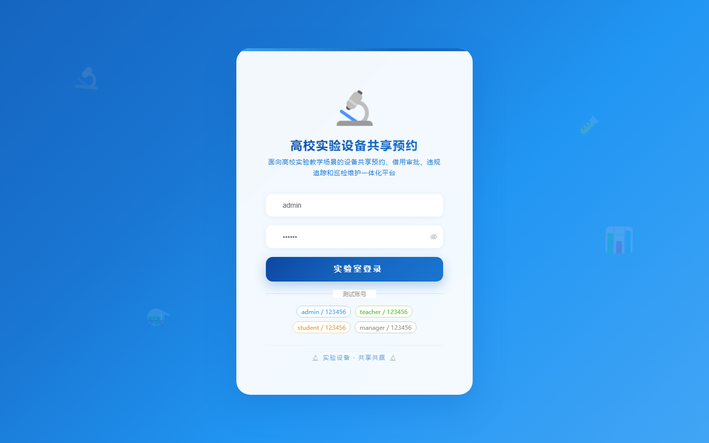

# 149 - 高校实验设备共享预约与违规使用追踪系统

## 项目信息

- 项目编号：`149`
- 组件类型：`backend, frontend`
- 后端入口：`http://127.0.0.1:8149`
- 前端入口：`http://127.0.0.1:3149`
- 账号来源：未识别
- 已收录截图：`17` 张

## 默认账号

- 暂未自动识别到默认账号

## 预览截图

### guest

#### guest-01-dashboard

#### guest-01-login

#### guest-02-register

#### guest-02-user

#### guest-03-asset

#### guest-04-lab

#### guest-05-category

#### guest-06-borrow-user

#### guest-07-reservation

#### guest-08-borrow-record

#### guest-09-usage

#### guest-10-violation

#### guest-11-maintenance

#### guest-12-return-confirm

#### guest-13-inspection

#### guest-14-notice

#### guest-15-log

