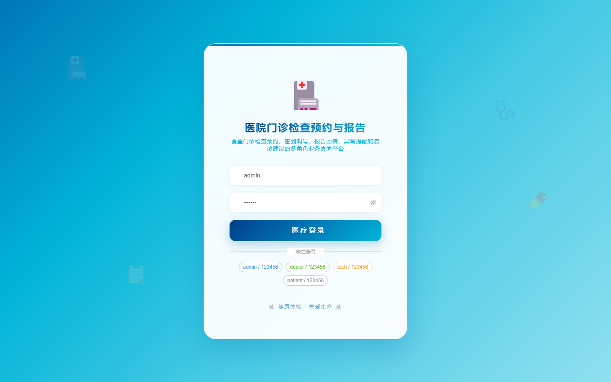
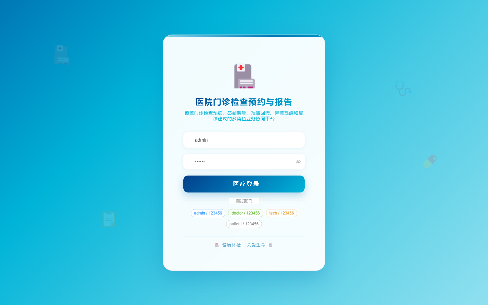

# 150 - 医院门诊检查预约与报告回传管理系统

## 项目信息

- 项目编号：`150`
- 组件类型：`backend, frontend`
- 后端入口：`http://127.0.0.1:8150`
- 前端入口：`http://127.0.0.1:3150`
- 账号来源：未识别
- 已收录截图：`17` 张

## 默认账号

- 暂未自动识别到默认账号

## 预览截图

### guest

#### guest-01-dashboard

#### guest-01-login

#### guest-02-register

#### guest-02-user

#### guest-03-item

#### guest-04-patient

#### guest-05-doctor

#### guest-06-appointment

#### guest-07-department

#### guest-08-checkin

#### guest-09-report

#### guest-10-alert

#### guest-11-delivery

#### guest-12-advice

#### guest-13-queue

#### guest-14-notice

#### guest-15-log

