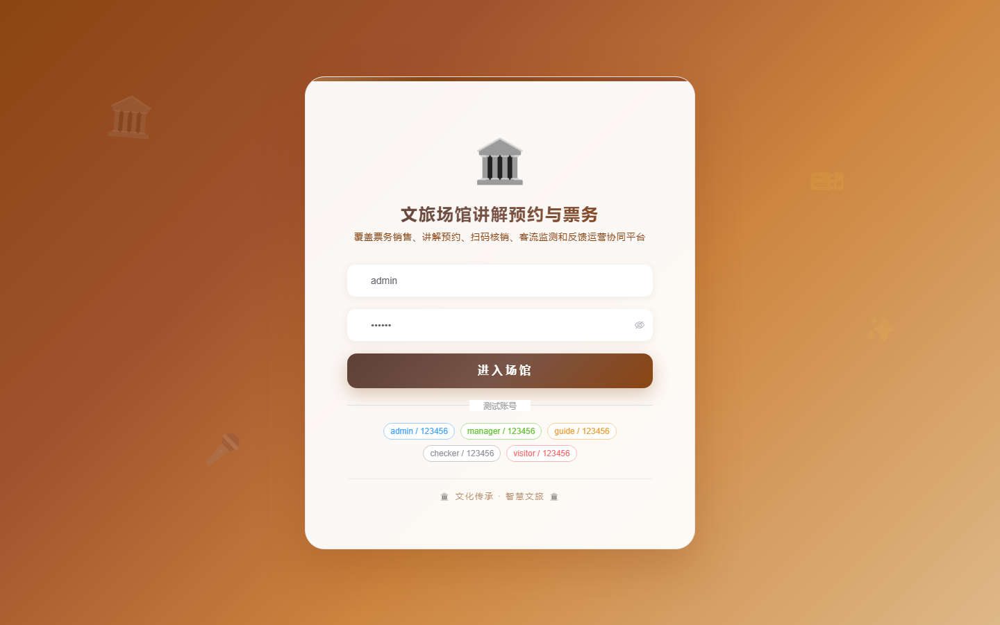
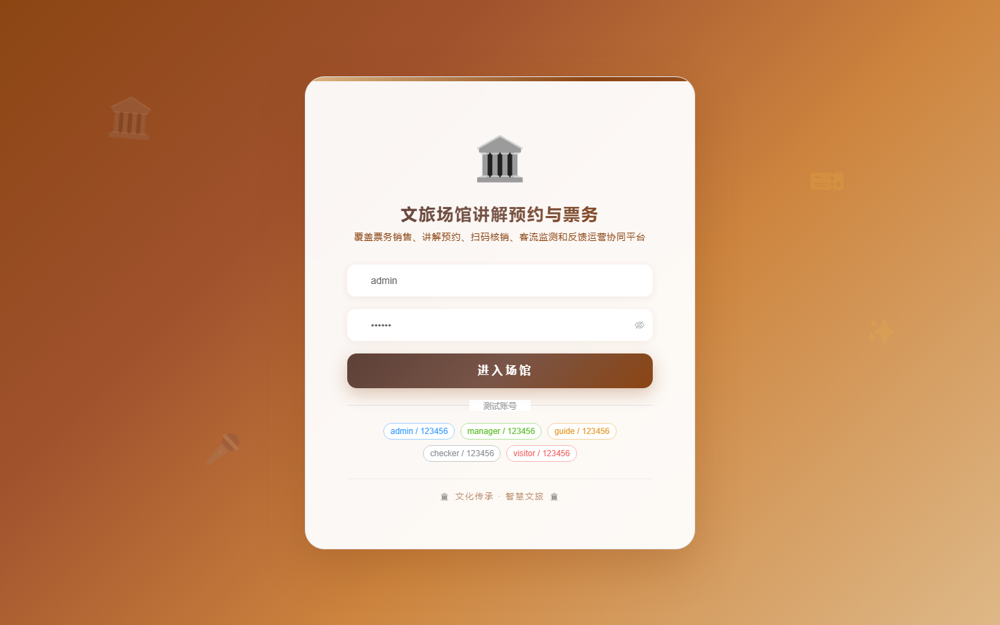

# 151 - 文旅场馆讲解预约与票务核销管理平台

## 项目信息

- 项目编号：`151`
- 组件类型：`backend, frontend`
- 后端入口：`http://127.0.0.1:8151`
- 前端入口：`http://127.0.0.1:3151`
- 账号来源：未识别
- 已收录截图：`16` 张

## 默认账号

- 暂未自动识别到默认账号

## 预览截图

### guest

#### guest-01-dashboard

#### guest-01-login

#### guest-02-register

#### guest-02-user

#### guest-03-venue

#### guest-04-ticket

#### guest-05-ticket-order

#### guest-06-guide

#### guest-07-schedule

#### guest-08-booking

#### guest-09-verification

#### guest-10-crowd-flow

#### guest-11-feedback

#### guest-12-activity

#### guest-13-notice

#### guest-14-log

