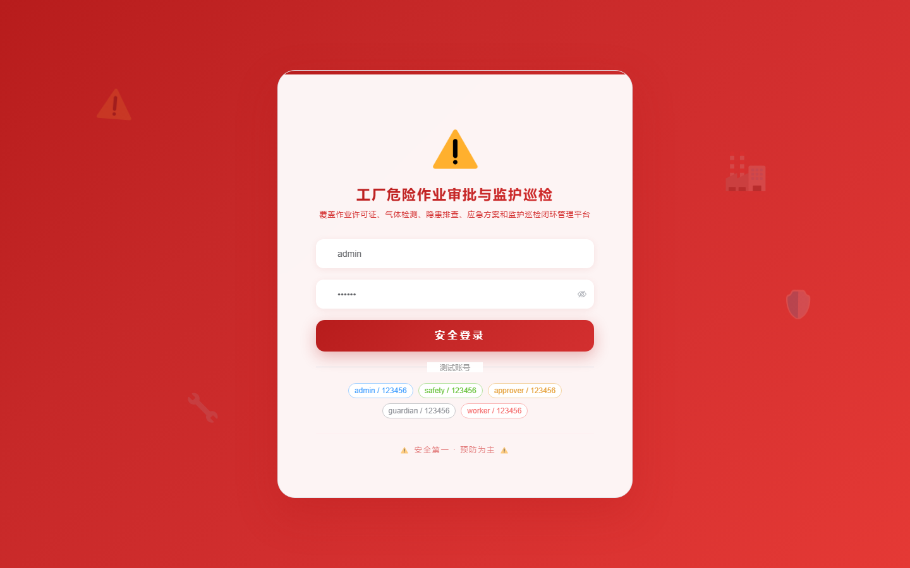
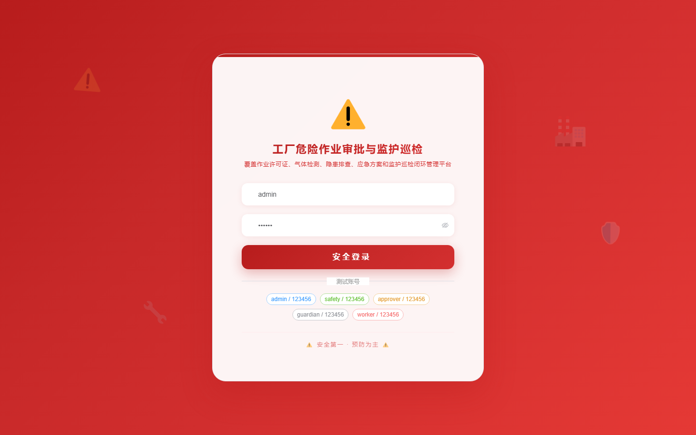
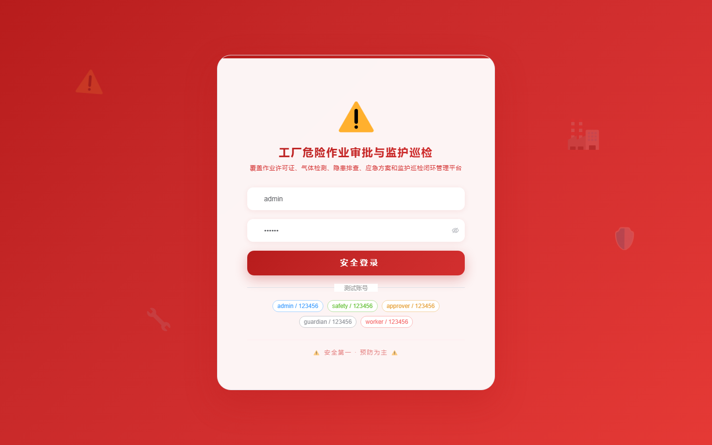

# 152 - 工厂危险作业审批与监护巡检管理系统

## 项目信息

- 项目编号：`152`
- 组件类型：`backend, frontend`
- 后端入口：`http://127.0.0.1:8152`
- 前端入口：`http://127.0.0.1:3152`
- 账号来源：未识别
- 已收录截图：`16` 张

## 默认账号

- 暂未自动识别到默认账号

## 预览截图

### guest

#### guest-01-dashboard

#### guest-01-login

#### guest-02-register

#### guest-02-user

#### guest-03-area

#### guest-04-hazard

#### guest-05-worker

#### guest-06-work-ticket

#### guest-07-approval

#### guest-08-briefing

#### guest-09-guardian

#### guest-10-monitor

#### guest-11-danger

#### guest-12-gas

#### guest-13-plan

#### guest-14-log

