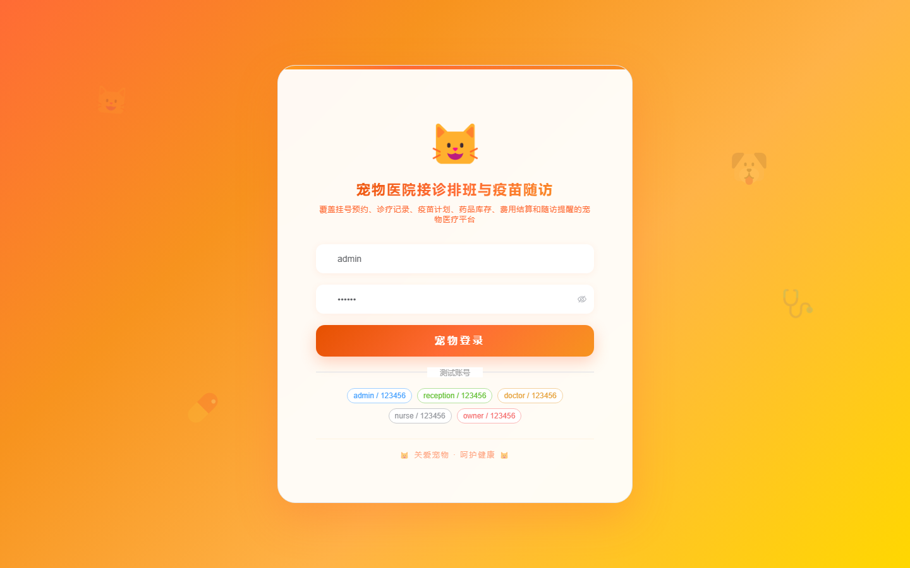
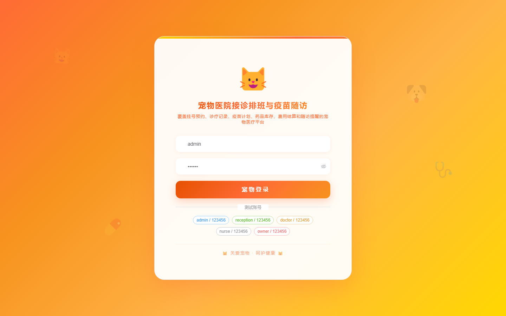

# 154 - 宠物医院接诊排班与疫苗随访管理系统

## 项目信息

- 项目编号：`154`
- 组件类型：`backend, frontend`
- 后端入口：`http://127.0.0.1:8154`
- 前端入口：`http://127.0.0.1:3154`
- 账号来源：未识别
- 已收录截图：`16` 张

## 默认账号

- 暂未自动识别到默认账号

## 预览截图

### guest

#### guest-01-dashboard

#### guest-01-login

#### guest-02-register

#### guest-02-user

#### guest-03-owner

#### guest-04-pet

#### guest-05-doctor

#### guest-06-schedule

#### guest-07-appointment

#### guest-08-visit

#### guest-09-vaccine-plan

#### guest-10-vaccine-record

#### guest-11-follow-up

#### guest-12-medicine

#### guest-13-billing

#### guest-14-log

