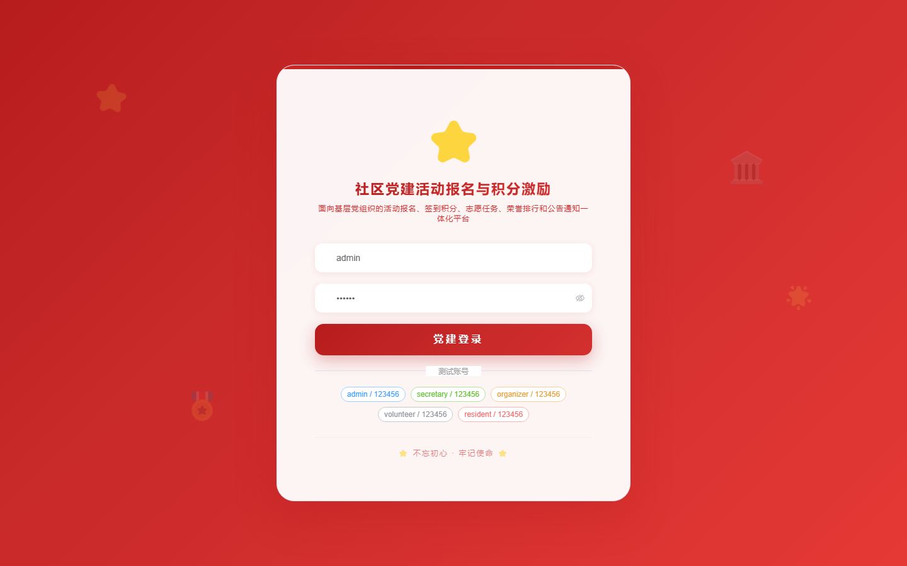
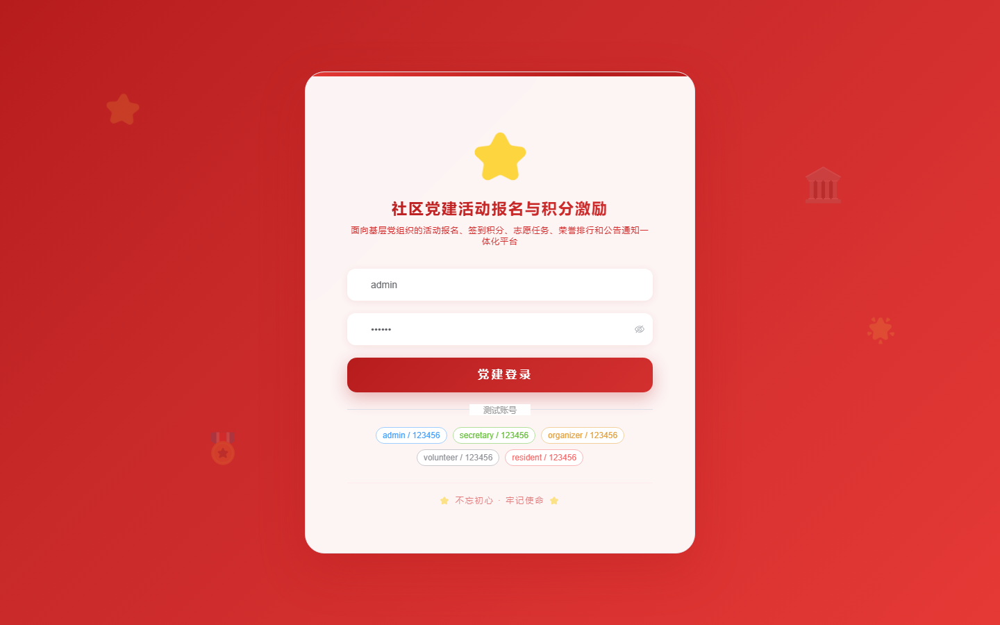

# 155 - 社区党建活动报名与积分激励平台

## 项目信息

- 项目编号：`155`
- 组件类型：`backend, frontend`
- 后端入口：`http://127.0.0.1:8155`
- 前端入口：`http://127.0.0.1:3155`
- 账号来源：未识别
- 已收录截图：`16` 张

## 默认账号

- 暂未自动识别到默认账号

## 预览截图

### guest

#### guest-01-dashboard

#### guest-01-login

#### guest-02-register

#### guest-02-user

#### guest-03-branch

#### guest-04-member

#### guest-05-activity

#### guest-06-registration

#### guest-07-attendance

#### guest-08-task

#### guest-09-points

#### guest-10-exchange

#### guest-11-transfer

#### guest-12-ranking

#### guest-13-notice

#### guest-14-log

