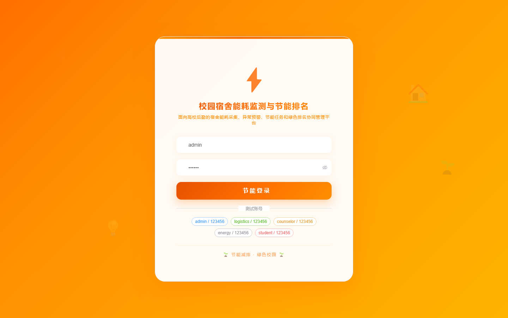

# 156 - 校园宿舍能耗监测与节能排名系统

## 项目信息

- 项目编号：`156`
- 组件类型：`backend, frontend`
- 后端入口：`http://127.0.0.1:8156`
- 前端入口：`http://127.0.0.1:3156`
- 账号来源：未识别
- 已收录截图：`16` 张

## 默认账号

- 暂未自动识别到默认账号

## 预览截图

### guest

#### guest-01-dashboard

#### guest-01-login

#### guest-02-register

#### guest-02-user

#### guest-03-building

#### guest-04-room

#### guest-05-meter

#### guest-06-reading

#### guest-07-bill

#### guest-08-rule

#### guest-09-alert

#### guest-10-task

#### guest-11-ranking

#### guest-12-inspection

#### guest-13-notice

#### guest-14-log

