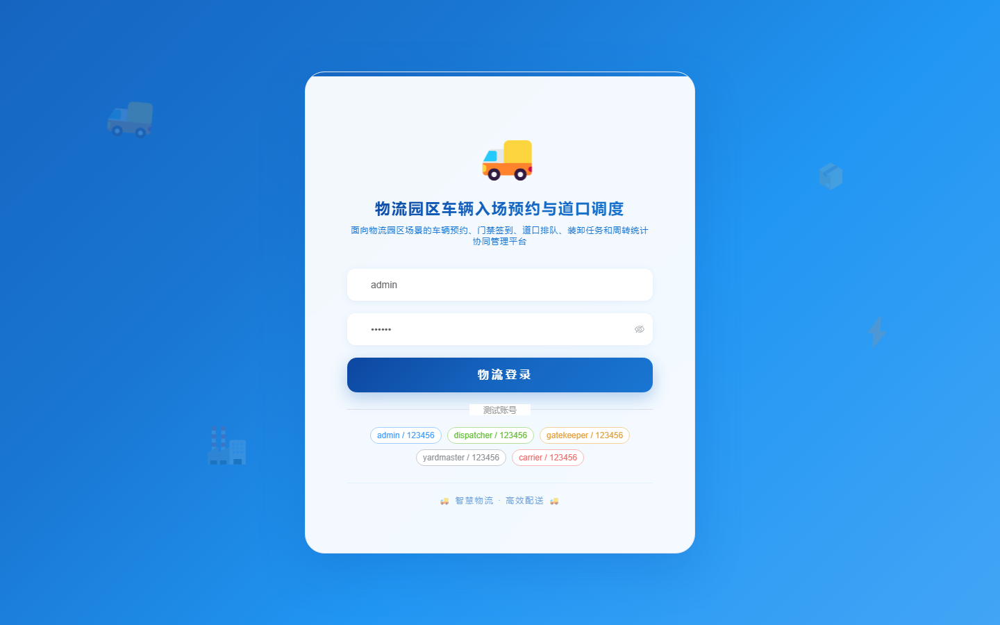
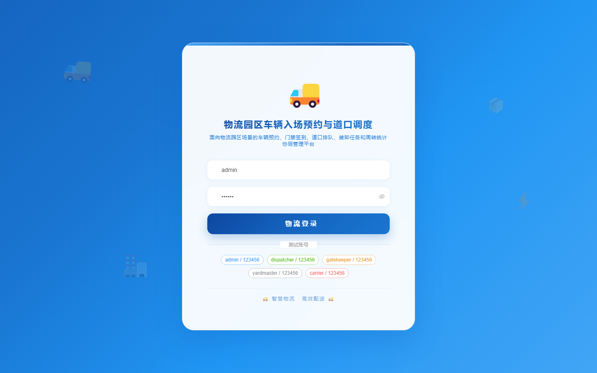

# 157 - 物流园区车辆入场预约与道口调度平台

## 项目信息

- 项目编号：`157`
- 组件类型：`backend, frontend`
- 后端入口：`http://127.0.0.1:8157`
- 前端入口：`http://127.0.0.1:3157`
- 账号来源：未识别
- 已收录截图：`16` 张

## 默认账号

- 暂未自动识别到默认账号

## 预览截图

### guest

#### guest-01-dashboard

#### guest-01-login

#### guest-02-register

#### guest-02-user

#### guest-03-carrier

#### guest-04-vehicle

#### guest-05-driver

#### guest-06-appointment

#### guest-07-slot

#### guest-08-checkin

#### guest-09-queue

#### guest-10-dock

#### guest-11-assignment

#### guest-12-loading

#### guest-13-turnaround

#### guest-14-log

