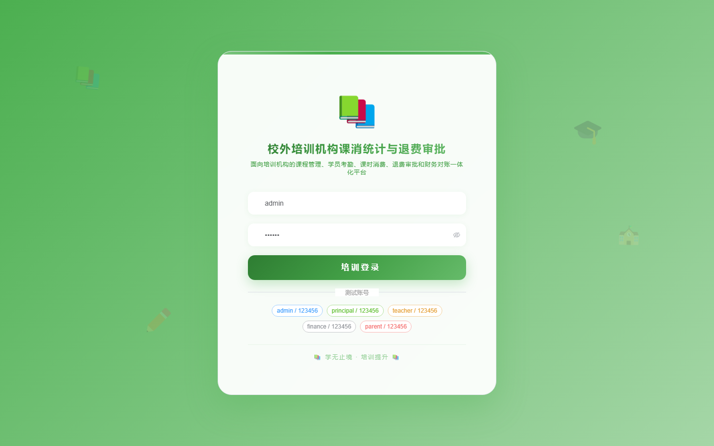
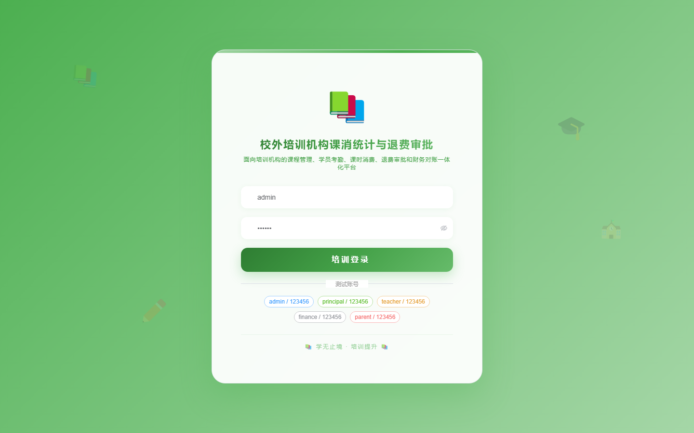

# 158 - 校外培训机构课消统计与退费审批系统

## 项目信息

- 项目编号：`158`
- 组件类型：`backend, frontend`
- 后端入口：`http://127.0.0.1:8158`
- 前端入口：`http://127.0.0.1:3158`
- 账号来源：未识别
- 已收录截图：`16` 张

## 默认账号

- 暂未自动识别到默认账号

## 预览截图

### guest

#### guest-01-dashboard

#### guest-01-login

#### guest-02-register

#### guest-02-user

#### guest-03-branch

#### guest-04-course

#### guest-05-student

#### guest-06-teacher

#### guest-07-classgroup

#### guest-08-schedule

#### guest-09-attendance

#### guest-10-consumption

#### guest-11-refund

#### guest-12-approval

#### guest-13-ledger

#### guest-14-log

