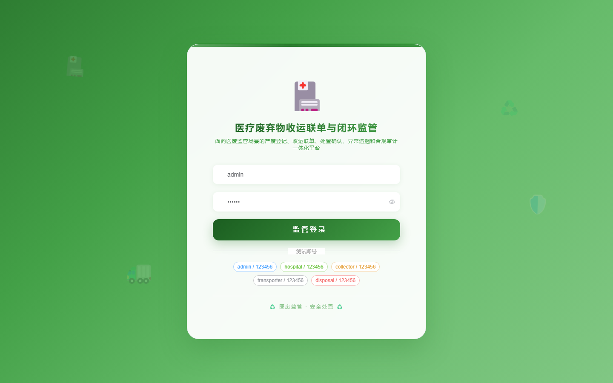
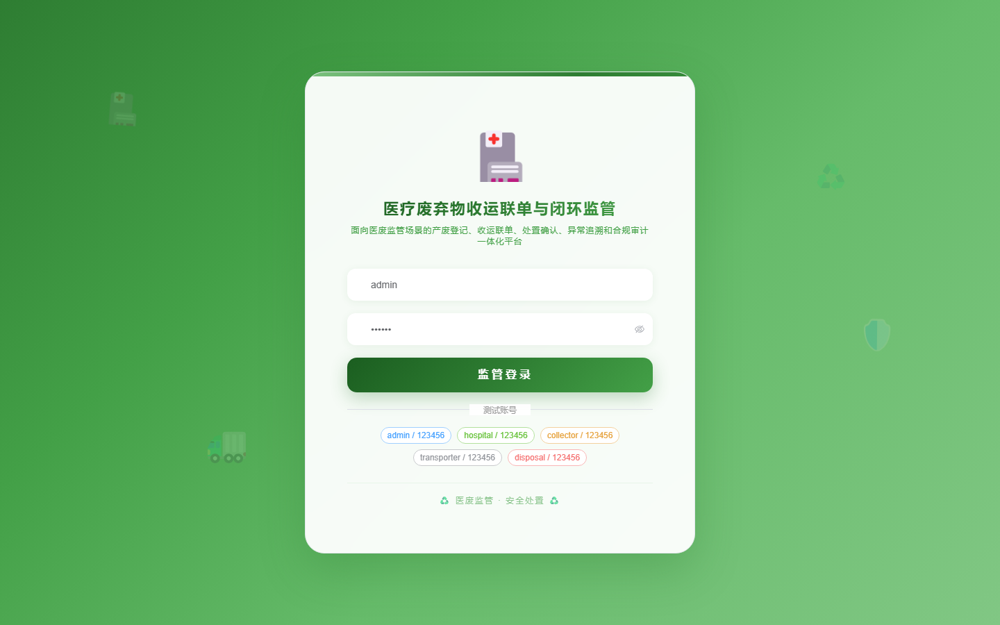

# 159 - 医疗废弃物收运联单与闭环监管系统

## 项目信息

- 项目编号：`159`
- 组件类型：`backend, frontend`
- 后端入口：`http://127.0.0.1:8159`
- 前端入口：`http://127.0.0.1:3159`
- 账号来源：未识别
- 已收录截图：`16` 张

## 默认账号

- 暂未自动识别到默认账号

## 预览截图

### guest

#### guest-01-dashboard

#### guest-01-login

#### guest-02-register

#### guest-02-user

#### guest-03-waste

#### guest-04-category

#### guest-05-package

#### guest-06-order

#### guest-07-weighing

#### guest-08-storage

#### guest-09-manifest

#### guest-10-track

#### guest-11-disposal

#### guest-12-exception

#### guest-13-audit

#### guest-14-log

