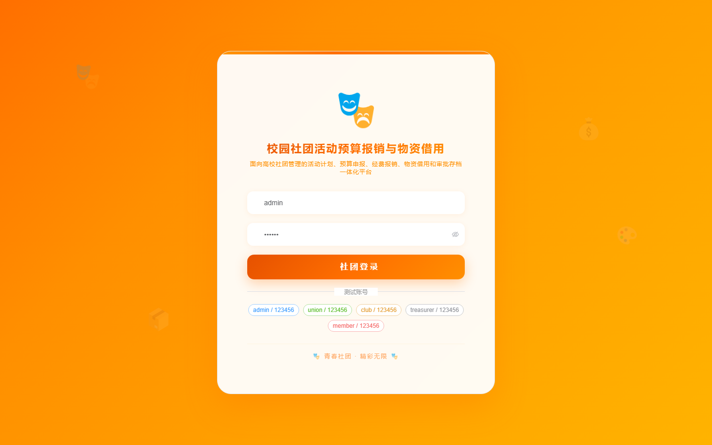
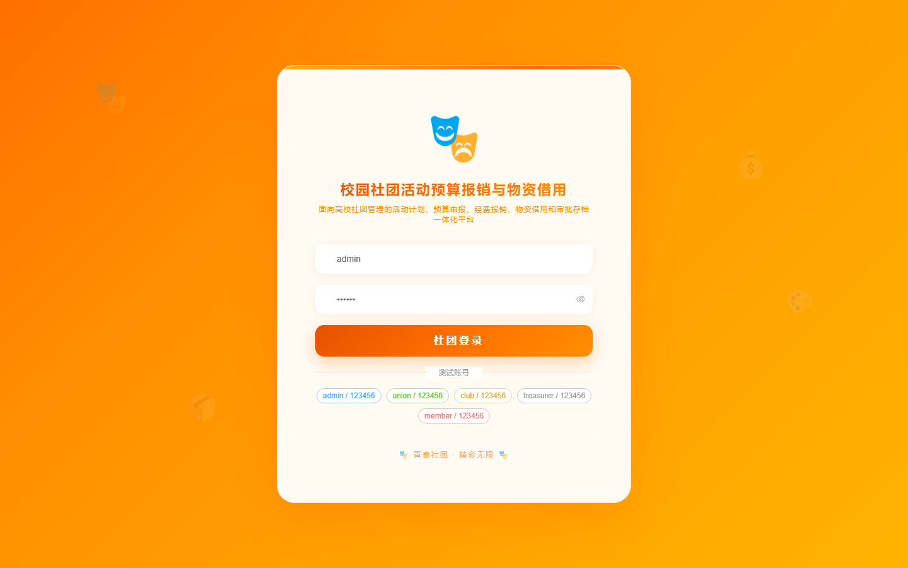

# 160 - 校园社团活动预算报销与物资借用系统

## 项目信息

- 项目编号：`160`
- 组件类型：`backend, frontend`
- 后端入口：`http://127.0.0.1:8160`
- 前端入口：`http://127.0.0.1:3160`
- 账号来源：未识别
- 已收录截图：`16` 张

## 默认账号

- 暂未自动识别到默认账号

## 预览截图

### guest

#### guest-01-dashboard

#### guest-01-login

#### guest-02-register

#### guest-02-user

#### guest-03-club

#### guest-04-member

#### guest-05-activity

#### guest-06-budget

#### guest-07-lineitem

#### guest-08-approval

#### guest-09-reimbursement

#### guest-10-receipt

#### guest-11-asset

#### guest-12-borrow

#### guest-13-returncheck

#### guest-14-log

