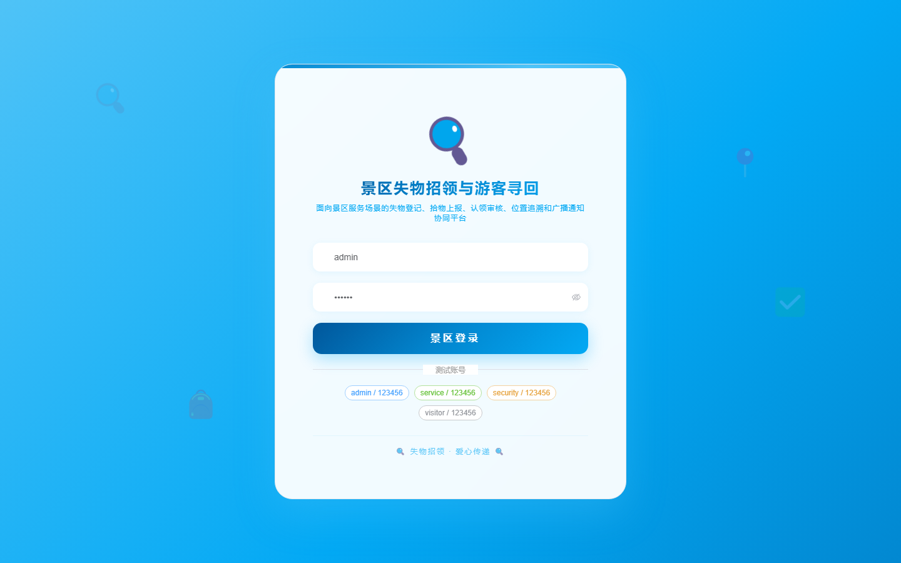

# 161 - 景区失物招领与游客寻回协同平台

## 项目信息

- 项目编号：`161`
- 组件类型：`backend, frontend`
- 后端入口：`http://127.0.0.1:8161`
- 前端入口：`http://127.0.0.1:3161`
- 账号来源：未识别
- 已收录截图：`16` 张

## 默认账号

- 暂未自动识别到默认账号

## 预览截图

### guest

#### guest-01-dashboard

#### guest-01-login

#### guest-02-register

#### guest-02-user

#### guest-03-area

#### guest-04-lost

#### guest-05-found

#### guest-06-claim

#### guest-07-verify

#### guest-08-trace

#### guest-09-custody

#### guest-10-notice

#### guest-11-handover

#### guest-12-search

#### guest-13-feedback

#### guest-14-log

