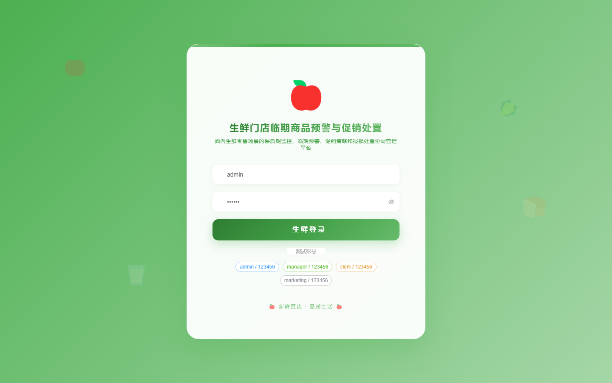
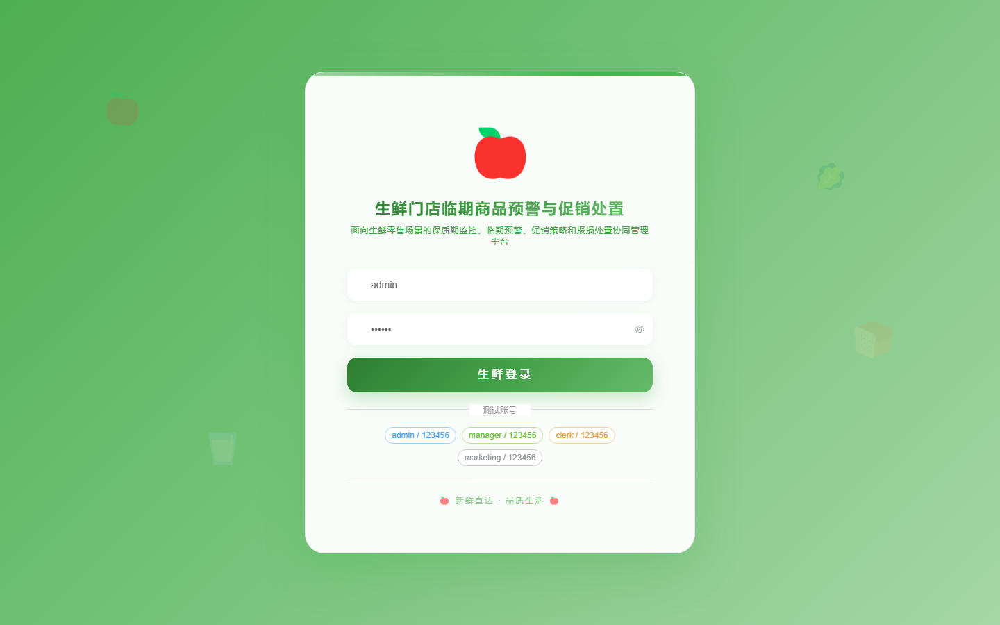

# 162 - 生鲜门店临期商品预警与促销处置系统

## 项目信息

- 项目编号：`162`
- 组件类型：`backend, frontend`
- 后端入口：`http://127.0.0.1:8162`
- 前端入口：`http://127.0.0.1:3162`
- 账号来源：未识别
- 已收录截图：`16` 张

## 默认账号

- 暂未自动识别到默认账号

## 预览截图

### guest

#### guest-01-dashboard

#### guest-01-login

#### guest-02-register

#### guest-02-user

#### guest-03-store

#### guest-04-supplier

#### guest-05-category

#### guest-06-batch

#### guest-07-rule

#### guest-08-warning

#### guest-09-promotion

#### guest-10-discount

#### guest-11-loss

#### guest-12-turnover

#### guest-13-analysis

#### guest-14-log

