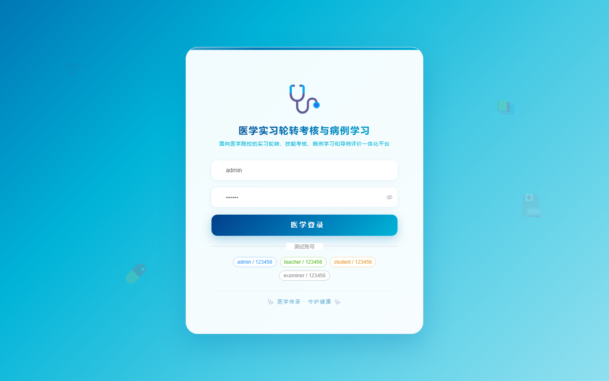
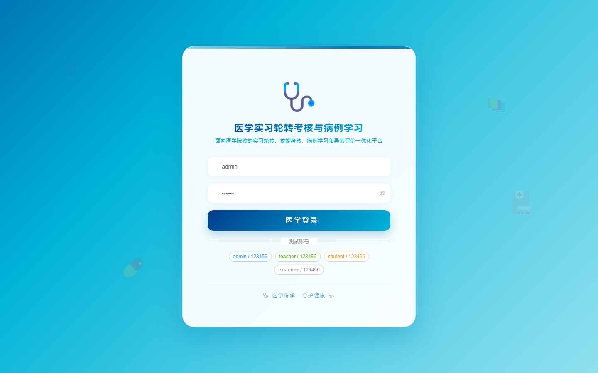

# 163 - 医学实习轮转考核与病例学习管理系统

## 项目信息

- 项目编号：`163`
- 组件类型：`backend, frontend`
- 后端入口：`http://127.0.0.1:8163`
- 前端入口：`http://127.0.0.1:3163`
- 账号来源：未识别
- 已收录截图：`16` 张

## 默认账号

- 暂未自动识别到默认账号

## 预览截图

### guest

#### guest-01-dashboard

#### guest-01-login

#### guest-02-register

#### guest-02-user

#### guest-03-department

#### guest-04-student

#### guest-05-teacher

#### guest-06-rotation

#### guest-07-case

#### guest-08-study

#### guest-09-round

#### guest-10-skill

#### guest-11-score

#### guest-12-exam

#### guest-13-feedback

#### guest-14-log

