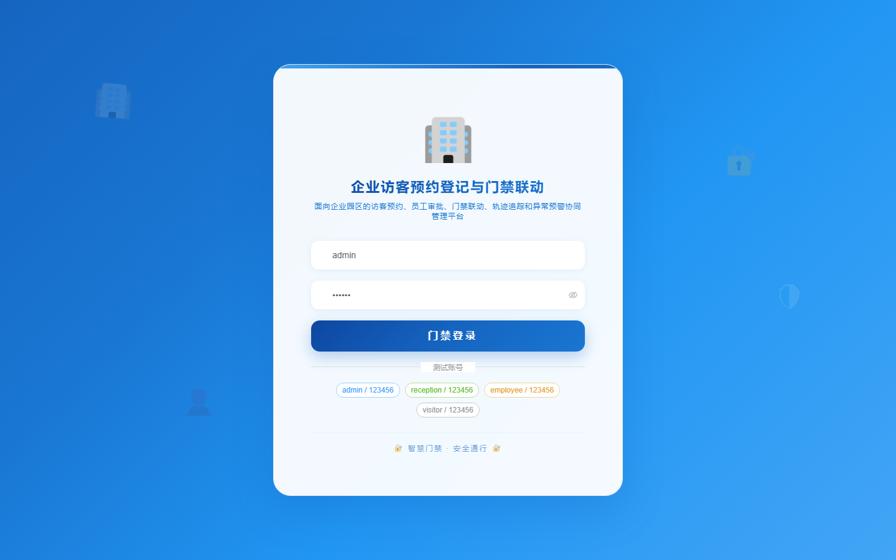

# 165 - 企业访客预约登记与门禁联动管理系统

## 项目信息

- 项目编号：`165`
- 组件类型：`backend, frontend`
- 后端入口：`http://127.0.0.1:8165`
- 前端入口：`http://127.0.0.1:3165`
- 账号来源：未识别
- 已收录截图：`16` 张

## 默认账号

- 暂未自动识别到默认账号

## 预览截图

### guest

#### guest-01-dashboard

#### guest-01-login

#### guest-02-register

#### guest-02-user

#### guest-03-zone

#### guest-04-host

#### guest-05-visitor

#### guest-06-appointment

#### guest-07-approval

#### guest-08-qrcode

#### guest-09-gate

#### guest-10-linkage

#### guest-11-entry

#### guest-12-trail

#### guest-13-alert

#### guest-14-log

