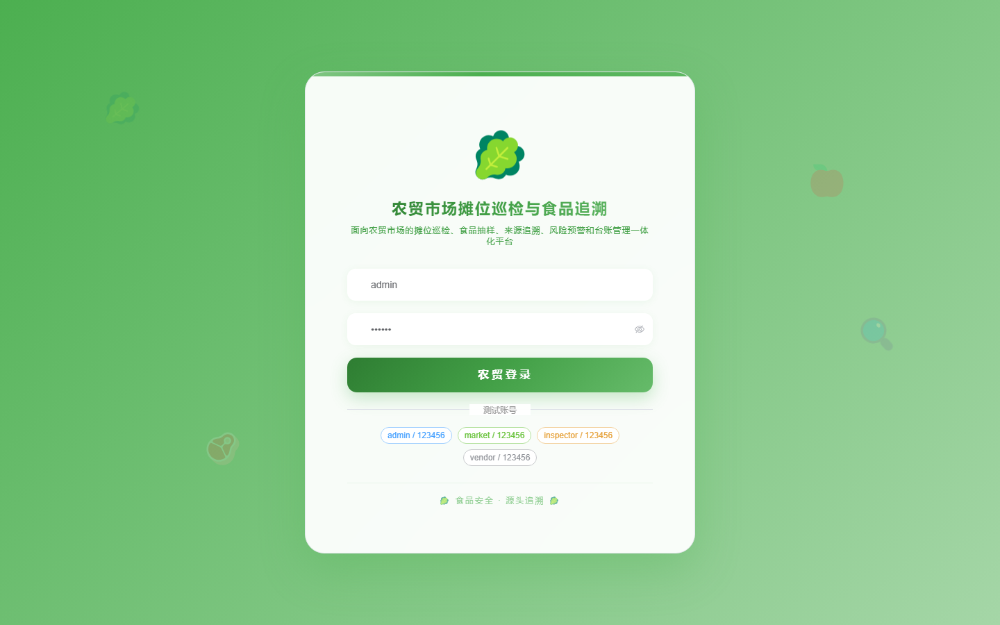
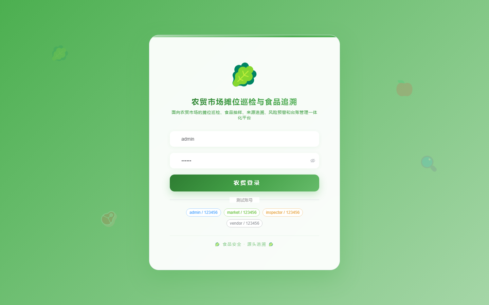
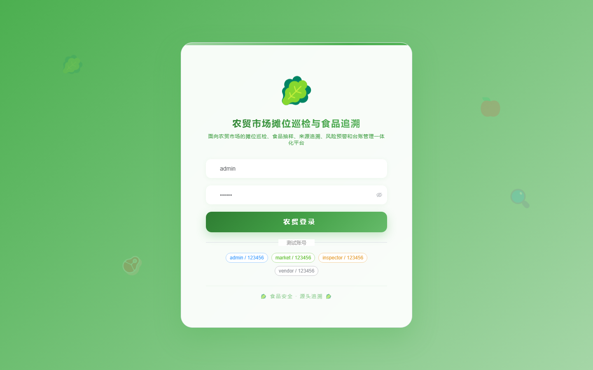

# 166 - 农贸市场摊位巡检与食品追溯台账系统

## 项目信息

- 项目编号：`166`
- 组件类型：`backend, frontend`
- 后端入口：`http://127.0.0.1:8166`
- 前端入口：`http://127.0.0.1:3166`
- 账号来源：未识别
- 已收录截图：`16` 张

## 默认账号

- 暂未自动识别到默认账号

## 预览截图

### guest

#### guest-01-dashboard

#### guest-01-login

#### guest-02-register

#### guest-02-user

#### guest-03-area

#### guest-04-stall

#### guest-05-vendor

#### guest-06-product

#### guest-07-inspection

#### guest-08-rectification

#### guest-09-sample

#### guest-10-test

#### guest-11-source

#### guest-12-disposal

#### guest-13-alert

#### guest-14-log

