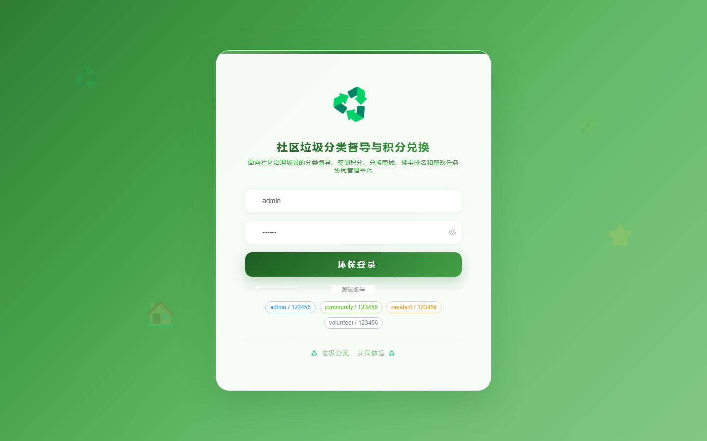
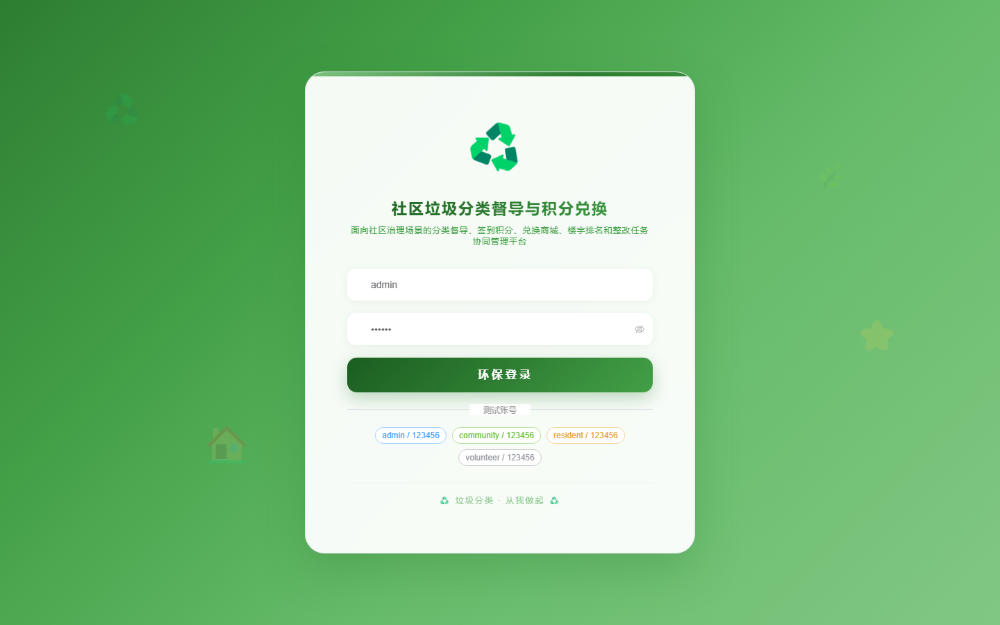

# 167 - 社区垃圾分类督导与积分兑换平台

## 项目信息

- 项目编号：`167`
- 组件类型：`backend, frontend`
- 后端入口：`http://127.0.0.1:8167`
- 前端入口：`http://127.0.0.1:3167`
- 账号来源：未识别
- 已收录截图：`16` 张

## 默认账号

- 暂未自动识别到默认账号

## 预览截图

### guest

#### guest-01-dashboard

#### guest-01-login

#### guest-02-register

#### guest-02-user

#### guest-03-area

#### guest-04-building

#### guest-05-resident

#### guest-06-category

#### guest-07-checkin

#### guest-08-supervision

#### guest-09-correction

#### guest-10-points

#### guest-11-reward

#### guest-12-exchange

#### guest-13-ranking

#### guest-14-log

