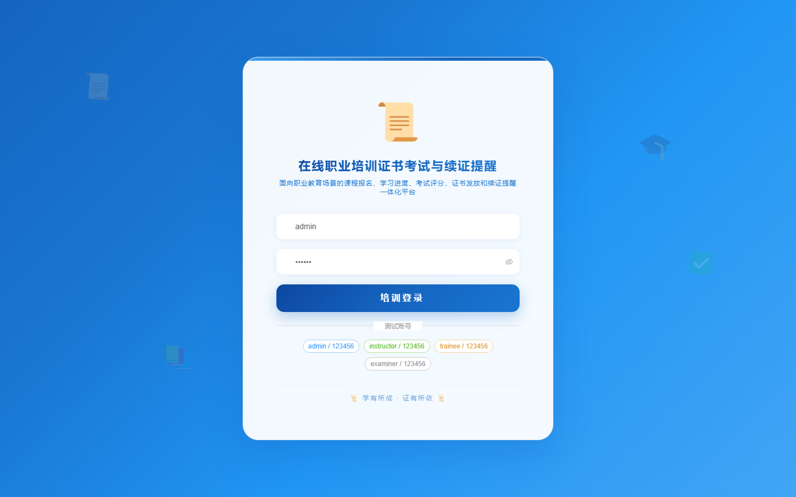

# 168 - 在线职业培训证书考试与续证提醒系统

## 项目信息

- 项目编号：`168`
- 组件类型：`backend, frontend`
- 后端入口：`http://127.0.0.1:8168`
- 前端入口：`http://127.0.0.1:3168`
- 账号来源：未识别
- 已收录截图：`16` 张

## 默认账号

- 暂未自动识别到默认账号

## 预览截图

### guest

#### guest-01-dashboard

#### guest-01-login

#### guest-02-register

#### guest-02-user

#### guest-03-course

#### guest-04-trainee

#### guest-05-instructor

#### guest-06-enrollment

#### guest-07-progress

#### guest-08-exam

#### guest-09-score

#### guest-10-certificate

#### guest-11-ledger

#### guest-12-renewal

#### guest-13-reminder

#### guest-14-log

