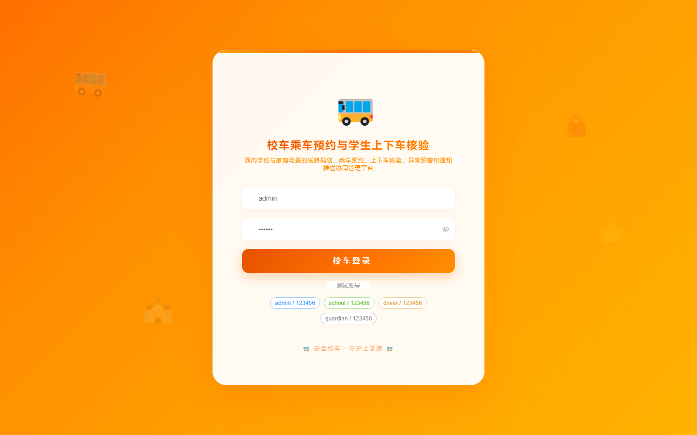

# 169 - 校车乘车预约与学生上下车核验系统

## 项目信息

- 项目编号：`169`
- 组件类型：`backend, frontend`
- 后端入口：`http://127.0.0.1:8169`
- 前端入口：`http://127.0.0.1:3169`
- 账号来源：未识别
- 已收录截图：`16` 张

## 默认账号

- 暂未自动识别到默认账号

## 预览截图

### guest

#### guest-01-dashboard

#### guest-01-login

#### guest-02-register

#### guest-02-user

#### guest-03-route

#### guest-04-stop

#### guest-05-vehicle

#### guest-06-driver

#### guest-07-student

#### guest-08-guardian

#### guest-09-reservation

#### guest-10-boarding

#### guest-11-dropoff

#### guest-12-exception

#### guest-13-notice

#### guest-14-log

