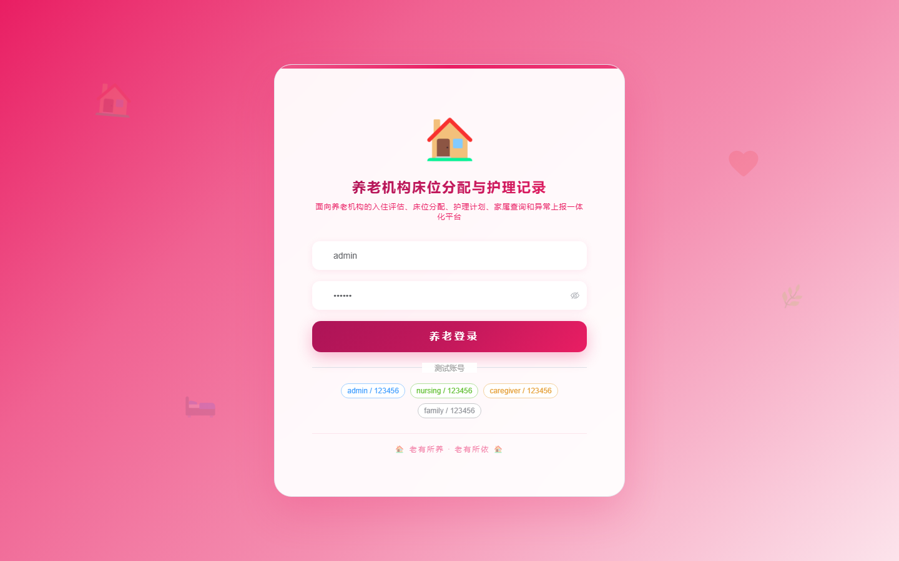
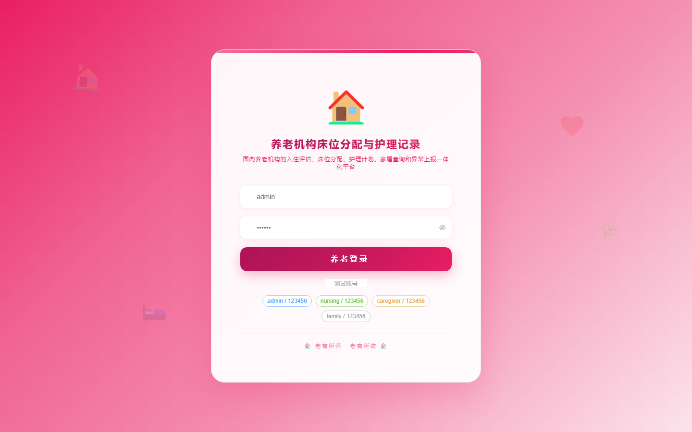

# 170 - 养老机构床位分配与护理记录管理系统

## 项目信息

- 项目编号：`170`
- 组件类型：`backend, frontend`
- 后端入口：`http://127.0.0.1:8170`
- 前端入口：`http://127.0.0.1:3170`
- 账号来源：未识别
- 已收录截图：`16` 张

## 默认账号

- 暂未自动识别到默认账号

## 预览截图

### guest

#### guest-01-dashboard

#### guest-01-login

#### guest-02-register

#### guest-02-user

#### guest-03-area

#### guest-04-room

#### guest-05-bed

#### guest-06-elder

#### guest-07-family

#### guest-08-assessment

#### guest-09-allocation

#### guest-10-plan

#### guest-11-care

#### guest-12-query

#### guest-13-exception

#### guest-14-log

