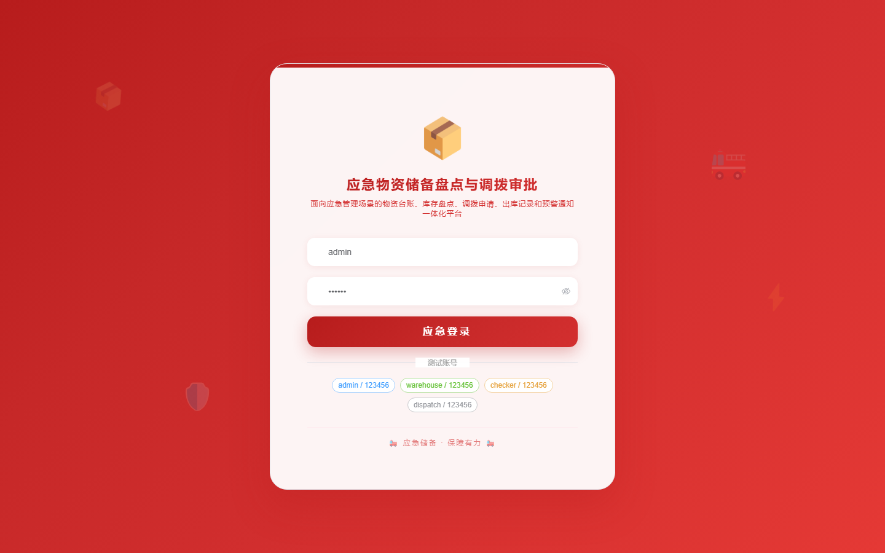

# 171 - 应急物资储备盘点与调拨审批平台

## 项目信息

- 项目编号：`171`
- 组件类型：`backend, frontend`
- 后端入口：`http://127.0.0.1:8171`
- 前端入口：`http://127.0.0.1:3171`
- 账号来源：未识别
- 已收录截图：`16` 张

## 默认账号

- 暂未自动识别到默认账号

## 预览截图

### guest

#### guest-01-dashboard

#### guest-01-login

#### guest-02-register

#### guest-02-user

#### guest-03-warehouse

#### guest-04-category

#### guest-05-material

#### guest-06-batch

#### guest-07-check

#### guest-08-difference

#### guest-09-requisition

#### guest-10-approval

#### guest-11-dispatch

#### guest-12-outbound

#### guest-13-warning

#### guest-14-log

