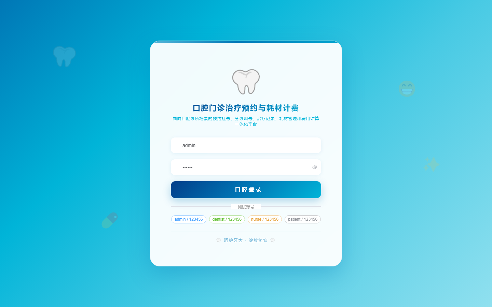
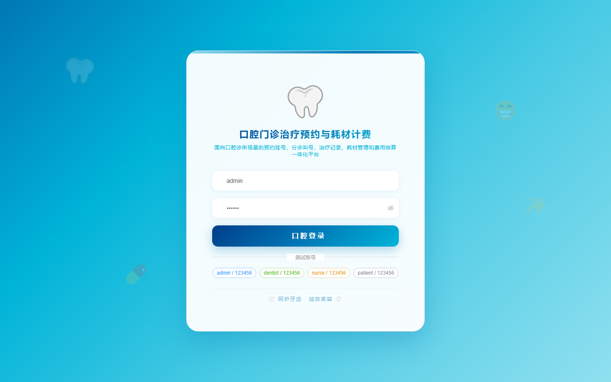

# 172 - 口腔门诊治疗预约与耗材计费管理系统

## 项目信息

- 项目编号：`172`
- 组件类型：`backend, frontend`
- 后端入口：`http://127.0.0.1:8172`
- 前端入口：`http://127.0.0.1:3172`
- 账号来源：未识别
- 已收录截图：`16` 张

## 默认账号

- 暂未自动识别到默认账号

## 预览截图

### guest

#### guest-01-dashboard

#### guest-01-login

#### guest-02-register

#### guest-02-user

#### guest-03-room

#### guest-04-dentist

#### guest-05-patient

#### guest-06-treatment

#### guest-07-appointment

#### guest-08-triage

#### guest-09-treatment-record

#### guest-10-consumable

#### guest-11-stock

#### guest-12-usage

#### guest-13-billing

#### guest-14-log

