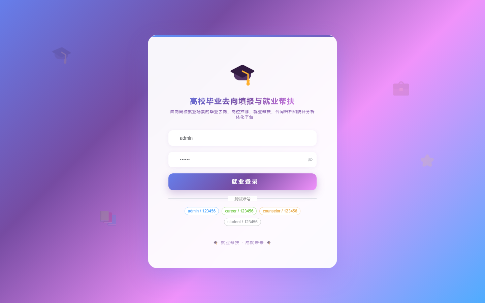

# 173 - 高校毕业去向填报与就业帮扶跟踪系统

## 项目信息

- 项目编号：`173`
- 组件类型：`backend, frontend`
- 后端入口：`http://127.0.0.1:8173`
- 前端入口：`http://127.0.0.1:3173`
- 账号来源：未识别
- 已收录截图：`16` 张

## 默认账号

- 暂未自动识别到默认账号

## 预览截图

### guest

#### guest-01-dashboard

#### guest-01-login

#### guest-02-register

#### guest-02-user

#### guest-03-major

#### guest-04-graduate

#### guest-05-employer

#### guest-06-job

#### guest-07-destination

#### guest-08-contract

#### guest-09-review

#### guest-10-assistance

#### guest-11-recommendation

#### guest-12-followup

#### guest-13-statistics

#### guest-14-log

