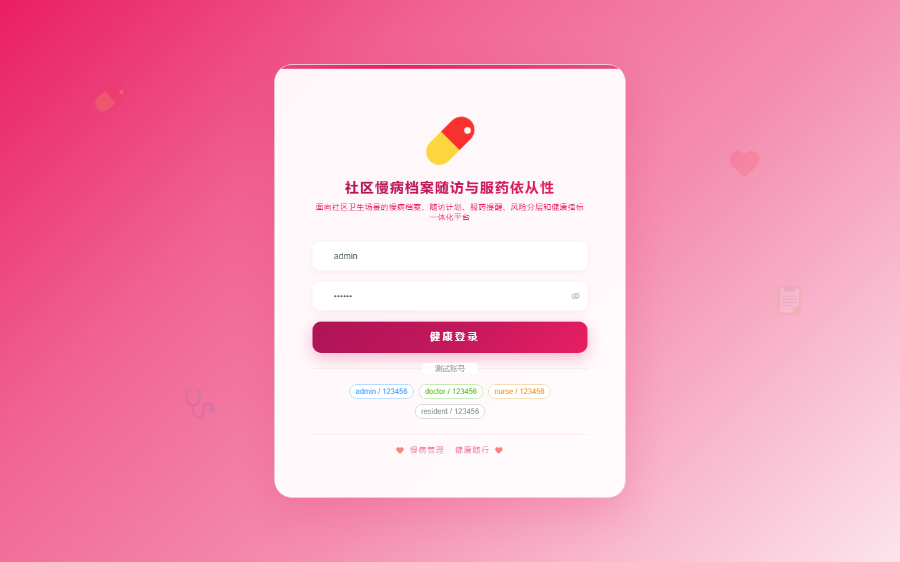
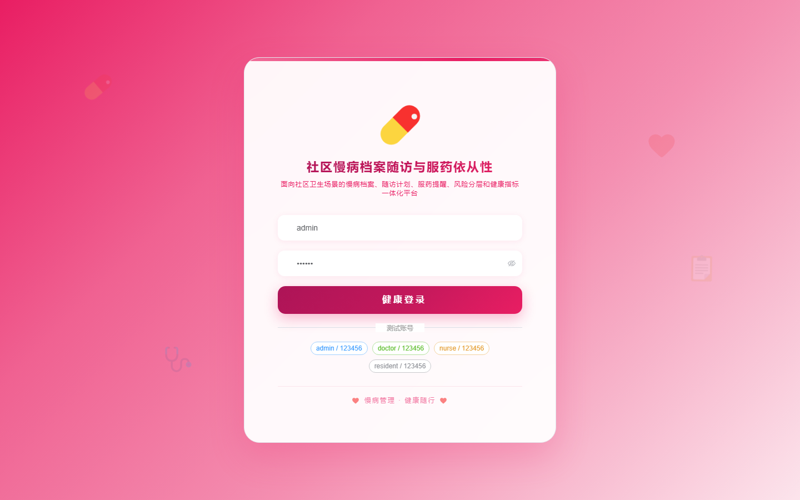

# 174 - 社区慢病档案随访与服药依从性管理系统

## 项目信息

- 项目编号：`174`
- 组件类型：`backend, frontend`
- 后端入口：`http://127.0.0.1:8174`
- 前端入口：`http://127.0.0.1:3174`
- 账号来源：未识别
- 已收录截图：`16` 张

## 默认账号

- 暂未自动识别到默认账号

## 预览截图

### guest

#### guest-01-dashboard

#### guest-01-login

#### guest-02-register

#### guest-02-user

#### guest-03-clinic

#### guest-04-patient

#### guest-05-team

#### guest-06-disease

#### guest-07-plan

#### guest-08-followup

#### guest-09-medication

#### guest-10-adherence

#### guest-11-indicator

#### guest-12-risk

#### guest-13-notice

#### guest-14-log

