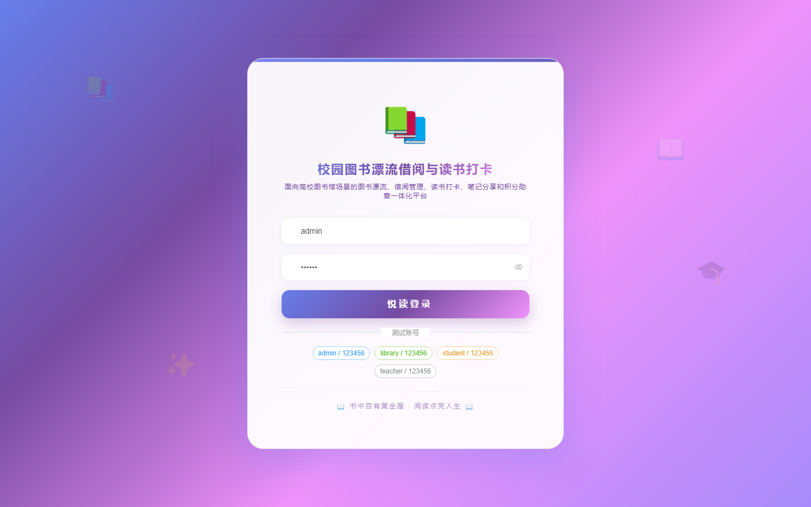
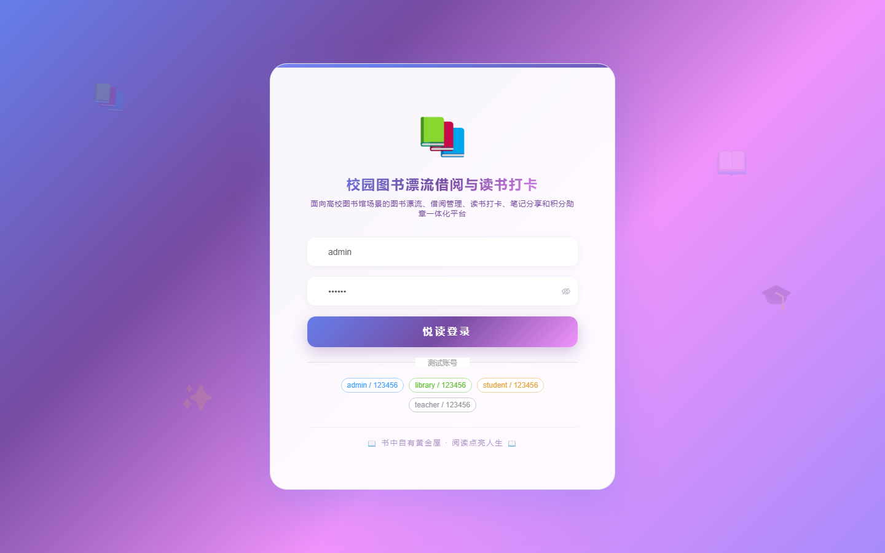

# 175 - 校园图书漂流借阅与读书打卡平台

## 项目信息

- 项目编号：`175`
- 组件类型：`backend, frontend`
- 后端入口：`http://127.0.0.1:8175`
- 前端入口：`http://127.0.0.1:3175`
- 账号来源：未识别
- 已收录截图：`16` 张

## 默认账号

- 暂未自动识别到默认账号

## 预览截图

### guest

#### guest-01-dashboard

#### guest-01-login

#### guest-02-register

#### guest-02-user

#### guest-03-shelf

#### guest-04-book

#### guest-05-reader

#### guest-06-donation

#### guest-07-borrow

#### guest-08-return

#### guest-09-checkin

#### guest-10-note

#### guest-11-medal

#### guest-12-activity

#### guest-13-notice

#### guest-14-log

