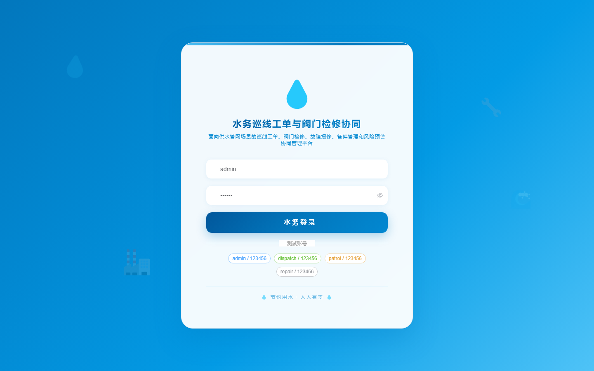
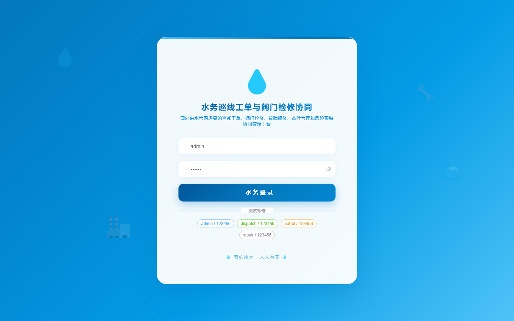

# 176 - 水务巡线工单与阀门检修协同管理系统

## 项目信息

- 项目编号：`176`
- 组件类型：`backend, frontend`
- 后端入口：`http://127.0.0.1:8176`
- 前端入口：`http://127.0.0.1:3176`
- 账号来源：未识别
- 已收录截图：`16` 张

## 默认账号

- 暂未自动识别到默认账号

## 预览截图

### guest

#### guest-01-dashboard

#### guest-01-login

#### guest-02-register

#### guest-02-user

#### guest-03-station

#### guest-04-section

#### guest-05-route

#### guest-06-valve

#### guest-07-task

#### guest-08-record

#### guest-09-fault

#### guest-10-dispatch

#### guest-11-receipt

#### guest-12-spare

#### guest-13-warning

#### guest-14-log

