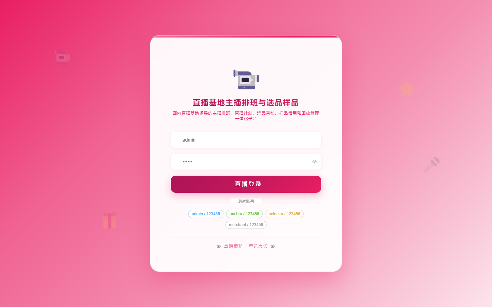

# 177 - 直播基地主播排班与选品样品管理系统

## 项目信息

- 项目编号：`177`
- 组件类型：`backend, frontend`
- 后端入口：`http://127.0.0.1:8177`
- 前端入口：`http://127.0.0.1:3177`
- 账号来源：未识别
- 已收录截图：`16` 张

## 默认账号

- 暂未自动识别到默认账号

## 预览截图

### guest

#### guest-01-dashboard

#### guest-01-login

#### guest-02-register

#### guest-02-user

#### guest-03-studio

#### guest-04-anchor

#### guest-05-merchant

#### guest-06-product

#### guest-07-sample

#### guest-08-loan

#### guest-09-schedule

#### guest-10-review

#### guest-11-plan

#### guest-12-session

#### guest-13-replay

#### guest-14-log

