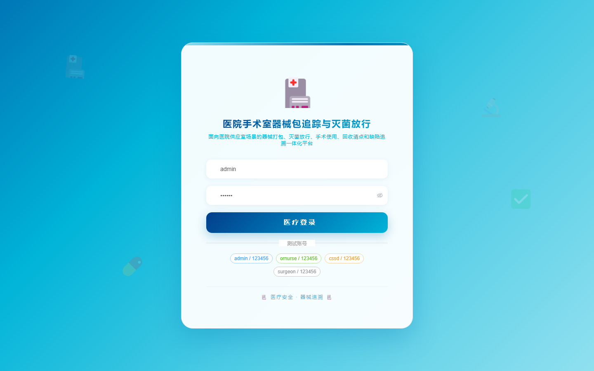

# 178 - 医院手术室器械包追踪与灭菌放行系统

## 项目信息

- 项目编号：`178`
- 组件类型：`backend, frontend`
- 后端入口：`http://127.0.0.1:8178`
- 前端入口：`http://127.0.0.1:3178`
- 账号来源：未识别
- 已收录截图：`16` 张

## 默认账号

- 暂未自动识别到默认账号

## 预览截图

### guest

#### guest-01-dashboard

#### guest-01-login

#### guest-02-register

#### guest-02-user

#### guest-03-room

#### guest-04-pack

#### guest-05-item

#### guest-06-trace

#### guest-07-batch

#### guest-08-sterilization

#### guest-09-release

#### guest-10-surgery

#### guest-11-return

#### guest-12-defect

#### guest-13-recall

#### guest-14-log

