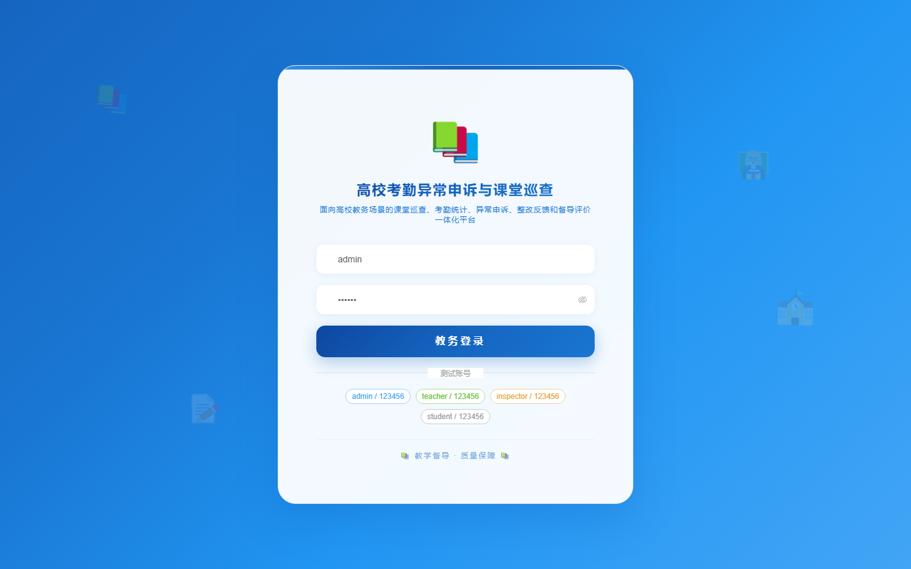

# 179 - 高校考勤异常申诉与课堂巡查管理系统

## 项目信息

- 项目编号：`179`
- 组件类型：`backend, frontend`
- 后端入口：`http://127.0.0.1:8179`
- 前端入口：`http://127.0.0.1:3179`
- 账号来源：未识别
- 已收录截图：`16` 张

## 默认账号

- 暂未自动识别到默认账号

## 预览截图

### guest

#### guest-01-dashboard

#### guest-01-login

#### guest-02-register

#### guest-02-user

#### guest-03-teaching

#### guest-04-student

#### guest-05-teacher

#### guest-06-schedule

#### guest-07-attendance

#### guest-08-appeal

#### guest-09-review

#### guest-10-inspection

#### guest-11-issue

#### guest-12-rectification

#### guest-13-feedback

#### guest-14-log

