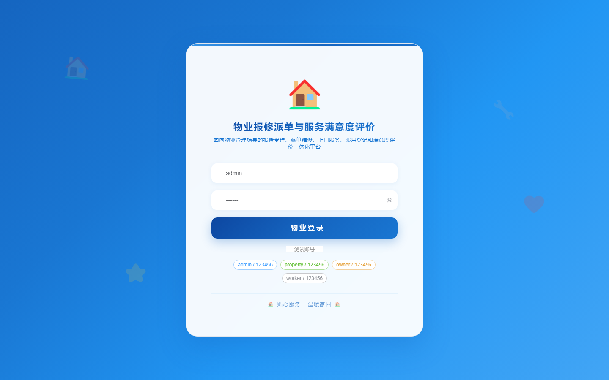
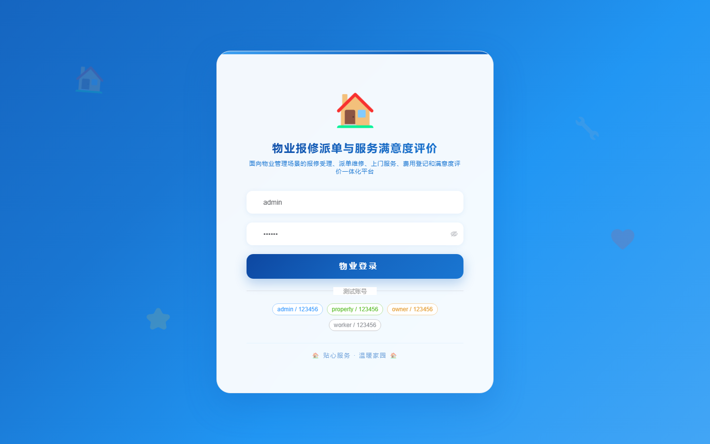

# 180 - 物业报修派单与服务满意度评价平台

## 项目信息

- 项目编号：`180`
- 组件类型：`backend, frontend`
- 后端入口：`http://127.0.0.1:8180`
- 前端入口：`http://127.0.0.1:3180`
- 账号来源：未识别
- 已收录截图：`16` 张

## 默认账号

- 暂未自动识别到默认账号

## 预览截图

### guest

#### guest-01-dashboard

#### guest-01-login

#### guest-02-register

#### guest-02-user

#### guest-03-area

#### guest-04-owner

#### guest-05-category

#### guest-06-repair

#### guest-07-dispatch

#### guest-08-service

#### guest-09-material

#### guest-10-fee

#### guest-11-payment

#### guest-12-review

#### guest-13-complaint

#### guest-14-log

