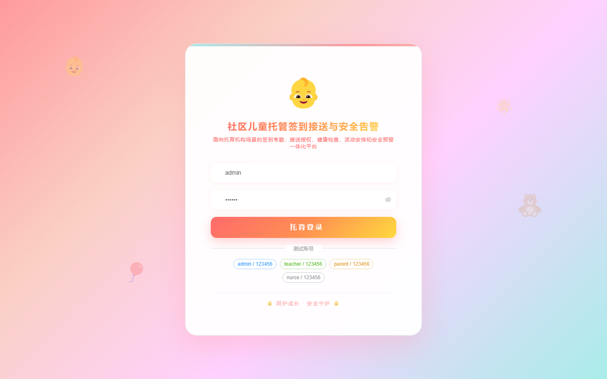
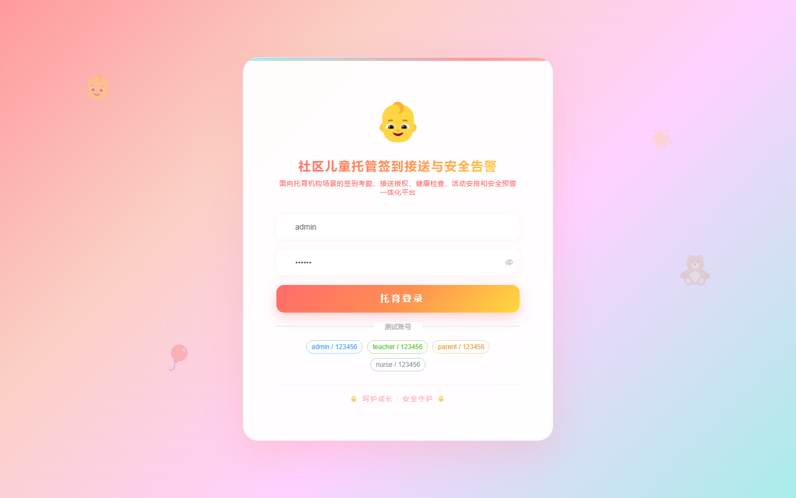

# 181 - 社区儿童托管签到接送与安全告警系统

## 项目信息

- 项目编号：`181`
- 组件类型：`backend, frontend`
- 后端入口：`http://127.0.0.1:8181`
- 前端入口：`http://127.0.0.1:3181`
- 账号来源：未识别
- 已收录截图：`16` 张

## 默认账号

- 暂未自动识别到默认账号

## 预览截图

### guest

#### guest-01-dashboard

#### guest-01-login

#### guest-02-register

#### guest-02-user

#### guest-03-classroom

#### guest-04-child

#### guest-05-guardian

#### guest-06-checkin

#### guest-07-authorization

#### guest-08-pickup

#### guest-09-alert

#### guest-10-health

#### guest-11-activity

#### guest-12-notice

#### guest-13-incident

#### guest-14-log

