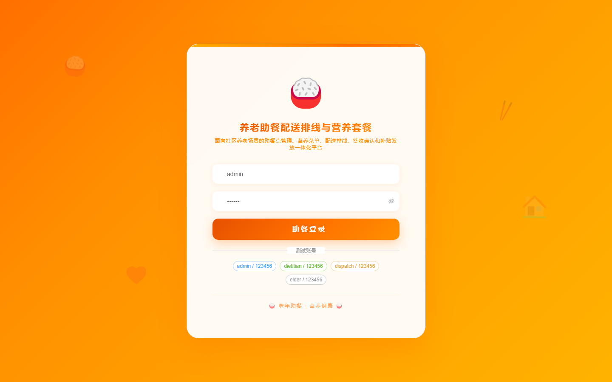

# 182 - 养老助餐配送排线与营养套餐管理系统

## 项目信息

- 项目编号：`182`
- 组件类型：`backend, frontend`
- 后端入口：`http://127.0.0.1:8182`
- 前端入口：`http://127.0.0.1:3182`
- 账号来源：未识别
- 已收录截图：`16` 张

## 默认账号

- 暂未自动识别到默认账号

## 预览截图

### guest

#### guest-01-dashboard

#### guest-01-login

#### guest-02-register

#### guest-02-user

#### guest-03-site

#### guest-04-elder

#### guest-05-menu

#### guest-06-order

#### guest-07-route

#### guest-08-delivery

#### guest-09-receipt

#### guest-10-restriction

#### guest-11-analysis

#### guest-12-subsidy

#### guest-13-followup

#### guest-14-log

