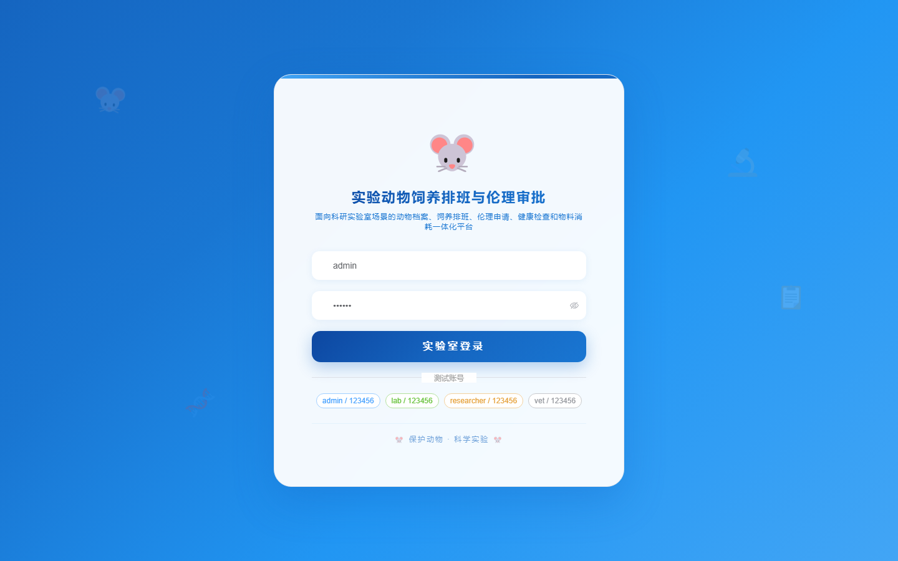

# 183 - 实验动物饲养排班与伦理审批管理系统

## 项目信息

- 项目编号：`183`
- 组件类型：`backend, frontend`
- 后端入口：`http://127.0.0.1:8183`
- 前端入口：`http://127.0.0.1:3183`
- 账号来源：未识别
- 已收录截图：`16` 张

## 默认账号

- 暂未自动识别到默认账号

## 预览截图

### guest

#### guest-01-dashboard

#### guest-01-login

#### guest-02-register

#### guest-02-user

#### guest-03-room

#### guest-04-animal

#### guest-05-schedule

#### guest-06-feeding

#### guest-07-ethics

#### guest-08-review

#### guest-09-experiment

#### guest-10-health

#### guest-11-alert

#### guest-12-treatment

#### guest-13-material

#### guest-14-log

