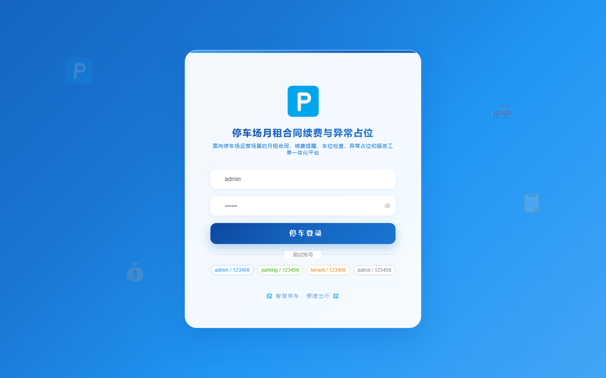
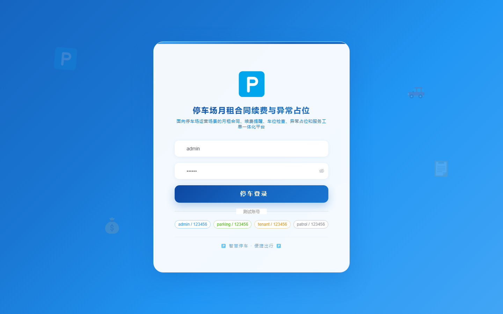

# 184 - 停车场月租合同续费与异常占位管理系统

## 项目信息

- 项目编号：`184`
- 组件类型：`backend, frontend`
- 后端入口：`http://127.0.0.1:8184`
- 前端入口：`http://127.0.0.1:3184`
- 账号来源：未识别
- 已收录截图：`16` 张

## 默认账号

- 暂未自动识别到默认账号

## 预览截图

### guest

#### guest-01-dashboard

#### guest-01-login

#### guest-02-register

#### guest-02-user

#### guest-03-lot

#### guest-04-space

#### guest-05-tenant

#### guest-06-contract

#### guest-07-reminder

#### guest-08-payment

#### guest-09-vehicle

#### guest-10-check

#### guest-11-abnormal

#### guest-12-handling

#### guest-13-ticket

#### guest-14-log

