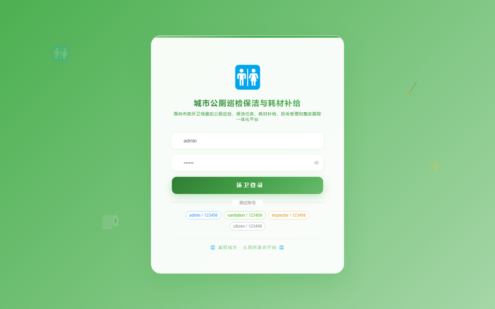
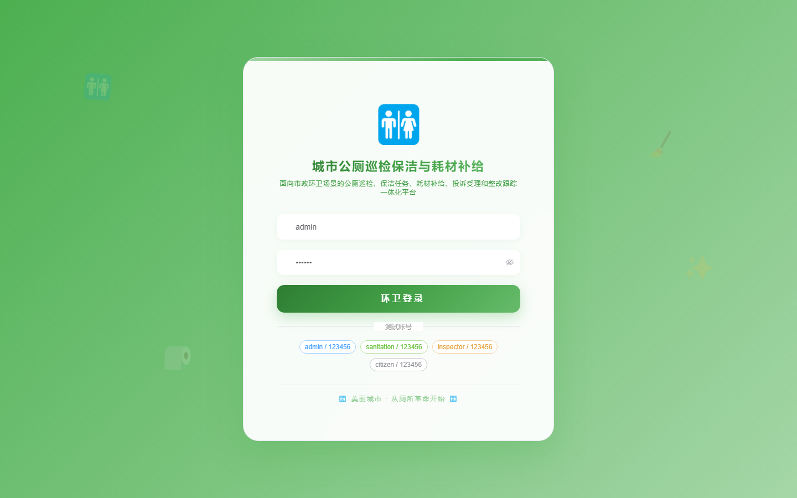

# 185 - 城市公厕巡检保洁与耗材补给调度系统

## 项目信息

- 项目编号：`185`
- 组件类型：`backend, frontend`
- 后端入口：`http://127.0.0.1:8185`
- 前端入口：`http://127.0.0.1:3185`
- 账号来源：未识别
- 已收录截图：`16` 张

## 默认账号

- 暂未自动识别到默认账号

## 预览截图

### guest

#### guest-01-dashboard

#### guest-01-login

#### guest-02-register

#### guest-02-user

#### guest-03-site

#### guest-04-route

#### guest-05-task

#### guest-06-record

#### guest-07-plan

#### guest-08-inspection

#### guest-09-stock

#### guest-10-request

#### guest-11-dispatch

#### guest-12-complaint

#### guest-13-rectification

#### guest-14-log

