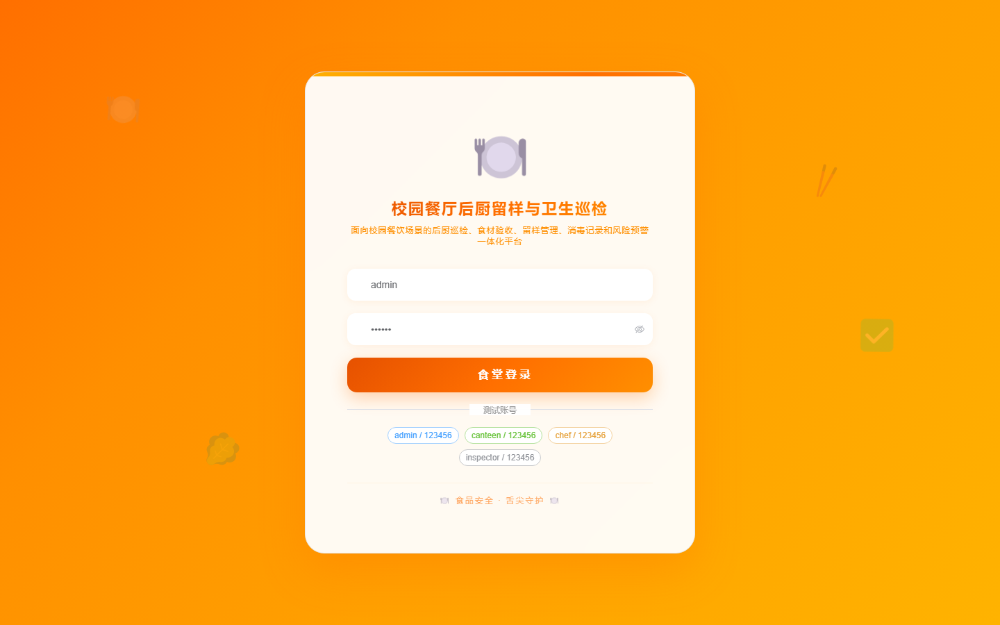

# 186 - 校园餐厅后厨留样与卫生巡检台账系统

## 项目信息

- 项目编号：`186`
- 组件类型：`backend, frontend`
- 后端入口：`http://127.0.0.1:8186`
- 前端入口：`http://127.0.0.1:3186`
- 账号来源：未识别
- 已收录截图：`16` 张

## 默认账号

- 暂未自动识别到默认账号

## 预览截图

### guest

#### guest-01-dashboard

#### guest-01-login

#### guest-02-register

#### guest-02-user

#### guest-03-canteen

#### guest-04-area

#### guest-05-dish

#### guest-06-sample

#### guest-07-storage

#### guest-08-ingredient

#### guest-09-disinfection

#### guest-10-inspection

#### guest-11-rectification

#### guest-12-risk

#### guest-13-waste

#### guest-14-log

