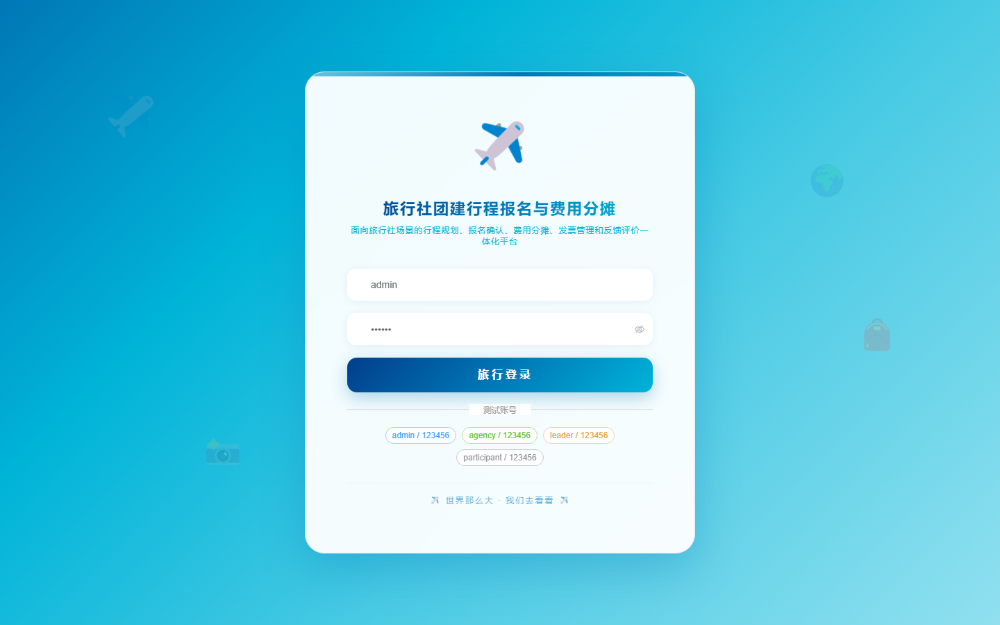

# 187 - 旅行社团建行程报名与费用分摊管理平台

## 项目信息

- 项目编号：`187`
- 组件类型：`backend, frontend`
- 后端入口：`http://127.0.0.1:8187`
- 前端入口：`http://127.0.0.1:3187`
- 账号来源：未识别
- 已收录截图：`16` 张

## 默认账号

- 暂未自动识别到默认账号

## 预览截图

### guest

#### guest-01-dashboard

#### guest-01-login

#### guest-02-register

#### guest-02-user

#### guest-03-agency

#### guest-04-team

#### guest-05-trip

#### guest-06-signup

#### guest-07-confirmation

#### guest-08-budget

#### guest-09-share

#### guest-10-payment

#### guest-11-notice

#### guest-12-feedback

#### guest-13-invoice

#### guest-14-log

