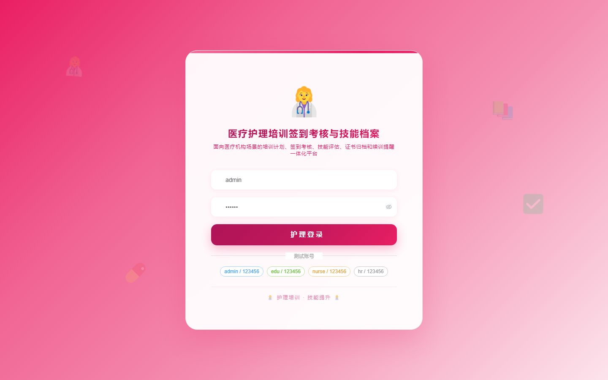

# 188 - 医疗护理培训签到考核与技能档案系统

## 项目信息

- 项目编号：`188`
- 组件类型：`backend, frontend`
- 后端入口：`http://127.0.0.1:8188`
- 前端入口：`http://127.0.0.1:3188`
- 账号来源：未识别
- 已收录截图：`16` 张

## 默认账号

- 暂未自动识别到默认账号

## 预览截图

### guest

#### guest-01-dashboard

#### guest-01-login

#### guest-02-register

#### guest-02-user

#### guest-03-program

#### guest-04-nurse

#### guest-05-class

#### guest-06-checkin

#### guest-07-skill

#### guest-08-assessment

#### guest-09-certificate

#### guest-10-retraining

#### guest-11-practice

#### guest-12-appeal

#### guest-13-notice

#### guest-14-log

