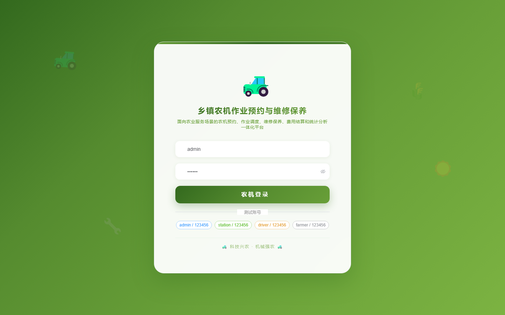
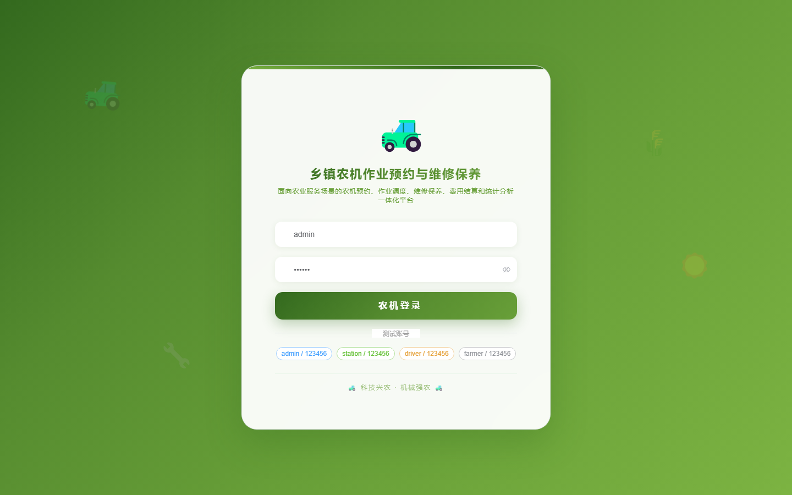

# 189 - 乡镇农机作业预约与维修保养跟踪平台

## 项目信息

- 项目编号：`189`
- 组件类型：`backend, frontend`
- 后端入口：`http://127.0.0.1:8189`
- 前端入口：`http://127.0.0.1:3189`
- 账号来源：未识别
- 已收录截图：`16` 张

## 默认账号

- 暂未自动识别到默认账号

## 预览截图

### guest

#### guest-01-dashboard

#### guest-01-login

#### guest-02-register

#### guest-02-user

#### guest-03-station

#### guest-04-machine

#### guest-05-farmer

#### guest-06-driver

#### guest-07-booking

#### guest-08-dispatch

#### guest-09-workorder

#### guest-10-completion

#### guest-11-maintenance

#### guest-12-repair

#### guest-13-season

#### guest-14-log

