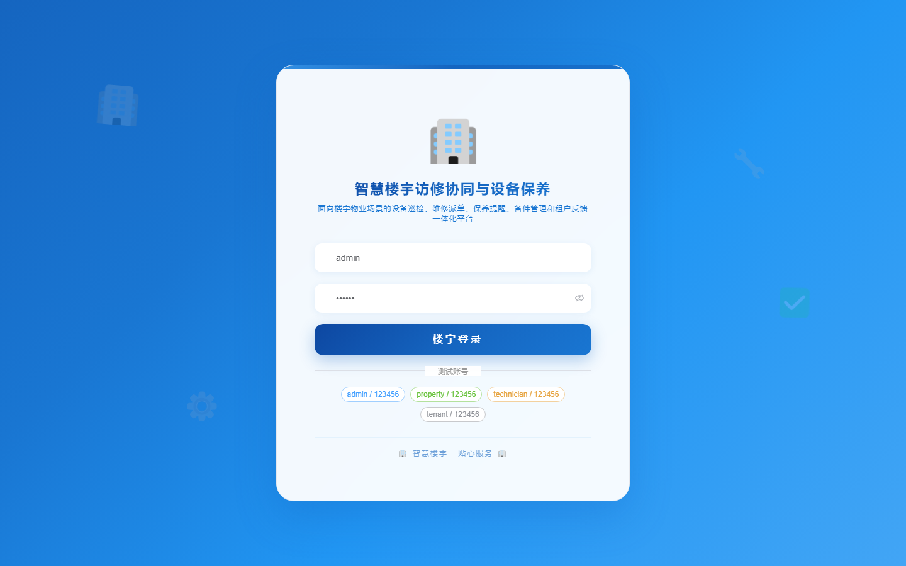
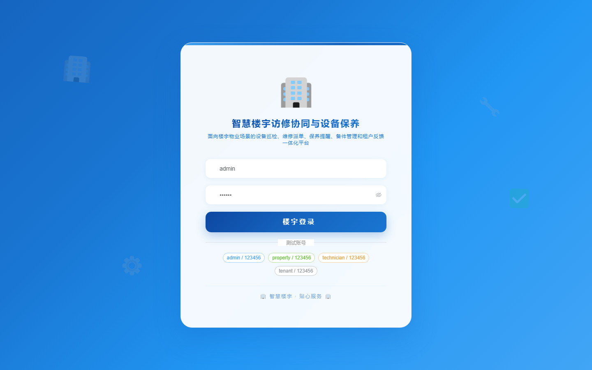

# 190 - 智慧楼宇访修协同与设备保养提醒系统

## 项目信息

- 项目编号：`190`
- 组件类型：`backend, frontend`
- 后端入口：`http://127.0.0.1:8190`
- 前端入口：`http://127.0.0.1:3190`
- 账号来源：未识别
- 已收录截图：`16` 张

## 默认账号

- 暂未自动识别到默认账号

## 预览截图

### guest

#### guest-01-dashboard

#### guest-01-login

#### guest-02-register

#### guest-02-user

#### guest-03-building

#### guest-04-equipment

#### guest-05-tenant

#### guest-06-ticket

#### guest-07-repair

#### guest-08-plan

#### guest-09-task

#### guest-10-alert

#### guest-11-inspection

#### guest-12-spare

#### guest-13-feedback

#### guest-14-log

