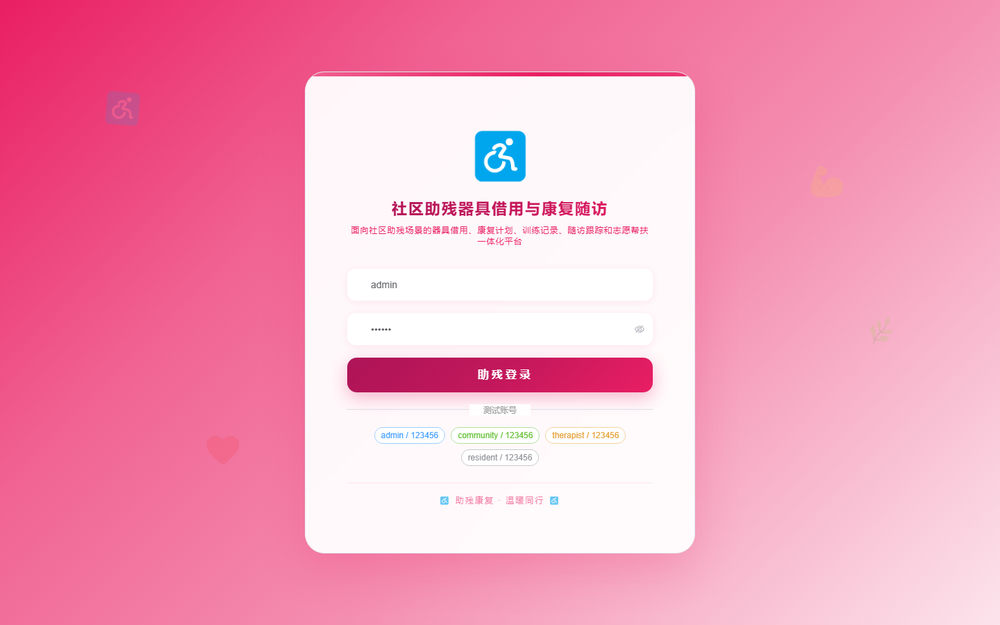
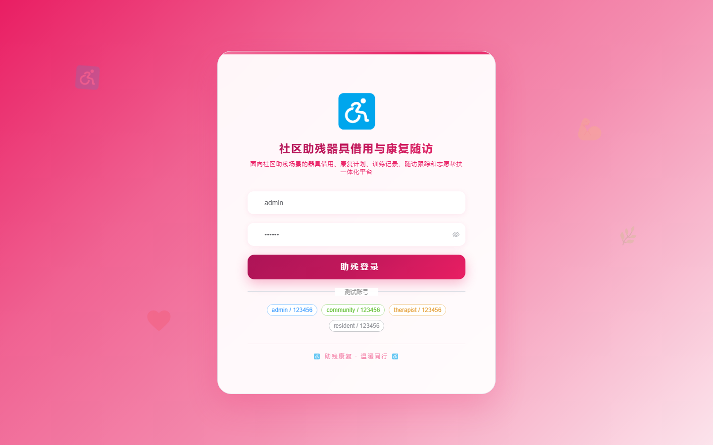

# 191 - 社区助残器具借用与康复随访平台

## 项目信息

- 项目编号：`191`
- 组件类型：`backend, frontend`
- 后端入口：`http://127.0.0.1:8191`
- 前端入口：`http://127.0.0.1:3191`
- 账号来源：未识别
- 已收录截图：`16` 张

## 默认账号

- 暂未自动识别到默认账号

## 预览截图

### guest

#### guest-01-dashboard

#### guest-01-login

#### guest-02-register

#### guest-02-user

#### guest-03-center

#### guest-04-resident

#### guest-05-device

#### guest-06-borrow

#### guest-07-approval

#### guest-08-delivery

#### guest-09-plan

#### guest-10-training

#### guest-11-followup

#### guest-12-reminder

#### guest-13-maintenance

#### guest-14-log

