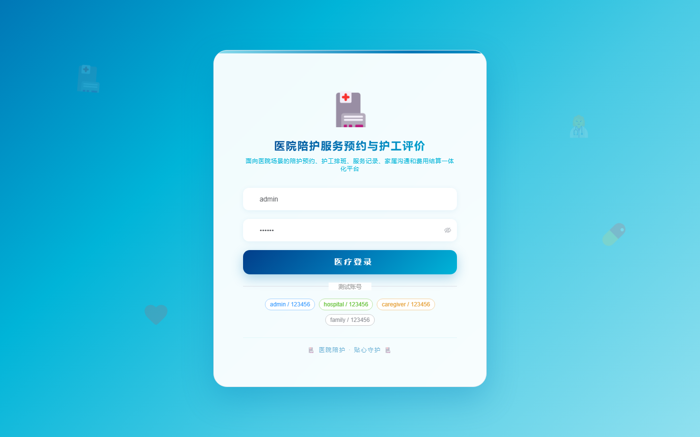

# 192 - 医院陪护服务预约与护工评价管理系统

## 项目信息

- 项目编号：`192`
- 组件类型：`backend, frontend`
- 后端入口：`http://127.0.0.1:8192`
- 前端入口：`http://127.0.0.1:3192`
- 账号来源：未识别
- 已收录截图：`16` 张

## 默认账号

- 暂未自动识别到默认账号

## 预览截图

### guest

#### guest-01-dashboard

#### guest-01-login

#### guest-02-register

#### guest-02-user

#### guest-03-ward

#### guest-04-patient

#### guest-05-caregiver

#### guest-06-appointment

#### guest-07-review

#### guest-08-schedule

#### guest-09-assignment

#### guest-10-service

#### guest-11-communication

#### guest-12-evaluation

#### guest-13-settlement

#### guest-14-log

