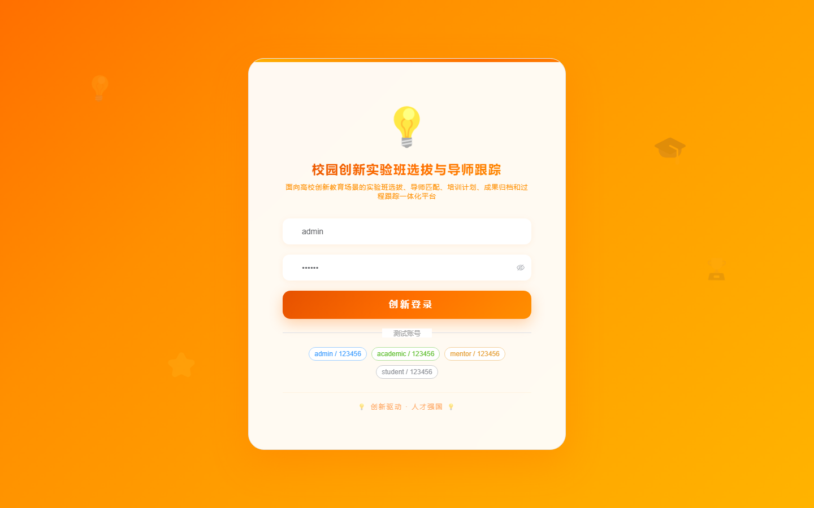

# 193 - 校园创新实验班选拔与导师跟踪管理系统

## 项目信息

- 项目编号：`193`
- 组件类型：`backend, frontend`
- 后端入口：`http://127.0.0.1:8193`
- 前端入口：`http://127.0.0.1:3193`
- 账号来源：未识别
- 已收录截图：`16` 张

## 默认账号

- 暂未自动识别到默认账号

## 预览截图

### guest

#### guest-01-dashboard

#### guest-01-login

#### guest-02-register

#### guest-02-user

#### guest-03-program

#### guest-04-student

#### guest-05-mentor

#### guest-06-notice

#### guest-07-application

#### guest-08-review

#### guest-09-interview

#### guest-10-match

#### guest-11-plan

#### guest-12-tracking

#### guest-13-achievement

#### guest-14-log

