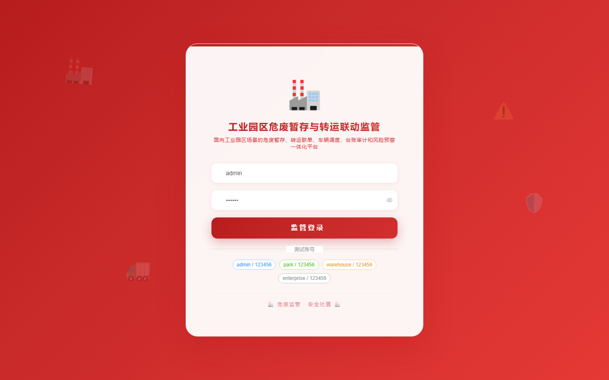
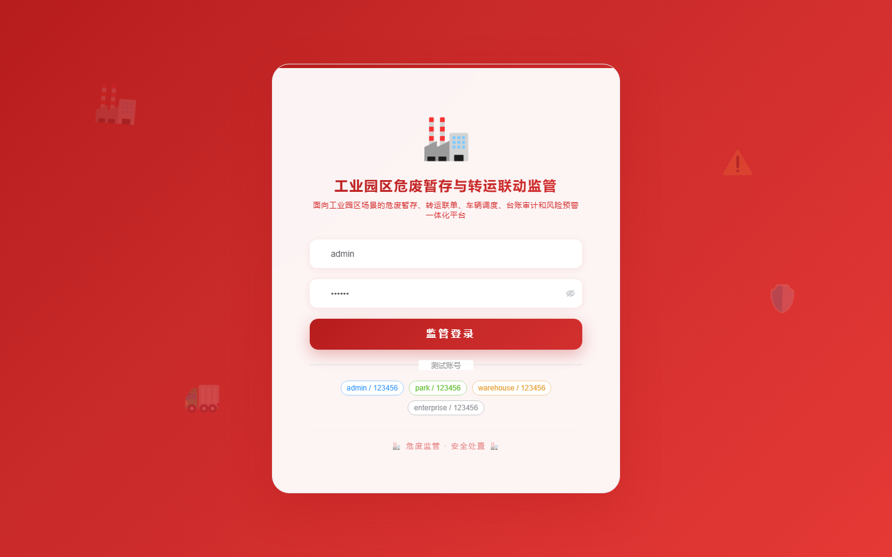

# 194 - 工业园区危废暂存与转运联动监管平台

## 项目信息

- 项目编号：`194`
- 组件类型：`backend, frontend`
- 后端入口：`http://127.0.0.1:8194`
- 前端入口：`http://127.0.0.1:3194`
- 账号来源：未识别
- 已收录截图：`16` 张

## 默认账号

- 暂未自动识别到默认账号

## 预览截图

### guest

#### guest-01-dashboard

#### guest-01-login

#### guest-02-register

#### guest-02-user

#### guest-03-enterprise

#### guest-04-waste

#### guest-05-facility

#### guest-06-inbound

#### guest-07-check

#### guest-08-transfer

#### guest-09-dispatch

#### guest-10-weighing

#### guest-11-handover

#### guest-12-warning

#### guest-13-audit

#### guest-14-log

