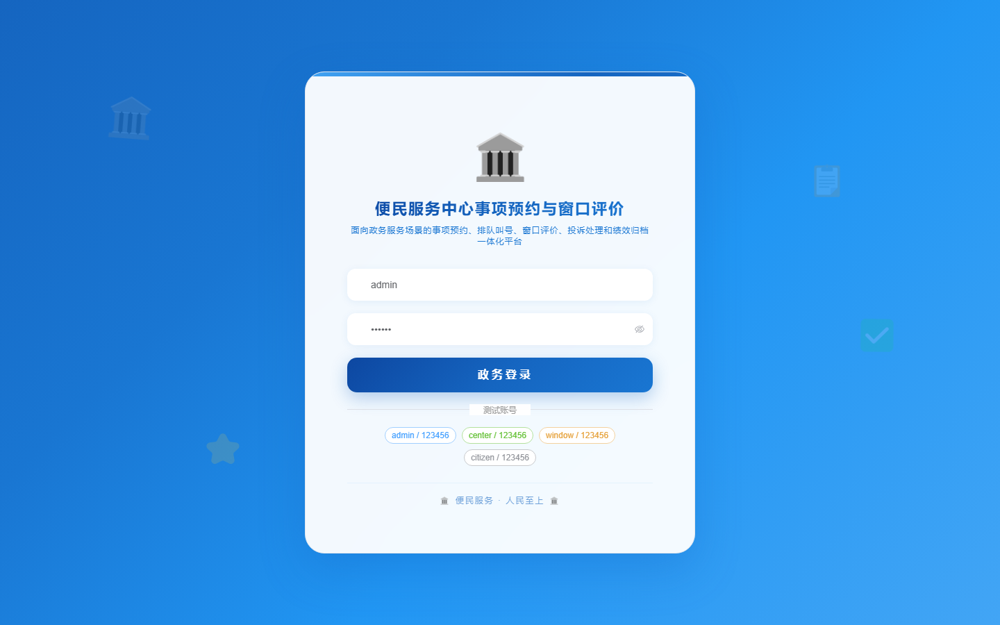

# 195 - 便民服务中心事项预约与窗口评价平台

## 项目信息

- 项目编号：`195`
- 组件类型：`backend, frontend`
- 后端入口：`http://127.0.0.1:8195`
- 前端入口：`http://127.0.0.1:3195`
- 账号来源：未识别
- 已收录截图：`16` 张

## 默认账号

- 暂未自动识别到默认账号

## 预览截图

### guest

#### guest-01-dashboard

#### guest-01-login

#### guest-02-register

#### guest-02-user

#### guest-03-item

#### guest-04-window

#### guest-05-roster

#### guest-06-appointment

#### guest-07-queue

#### guest-08-review

#### guest-09-progress

#### guest-10-notice

#### guest-11-evaluation

#### guest-12-complaint

#### guest-13-performance

#### guest-14-log

