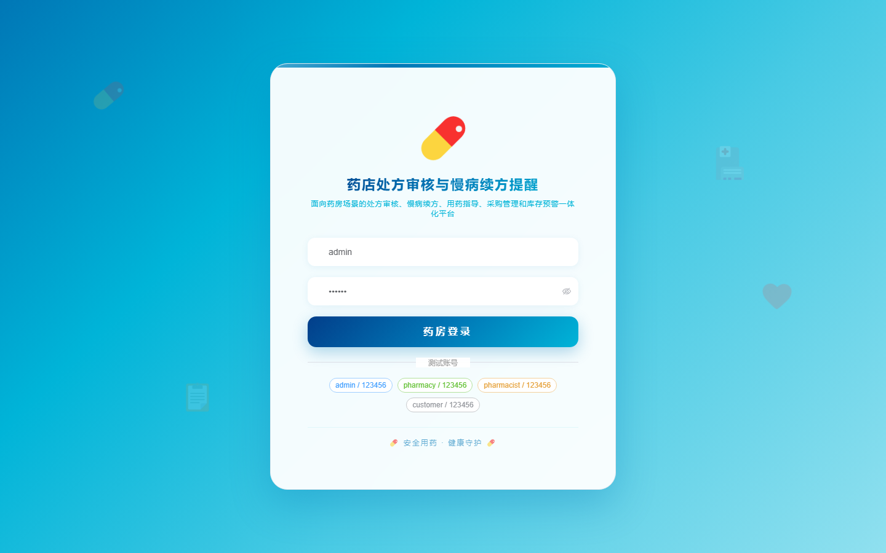
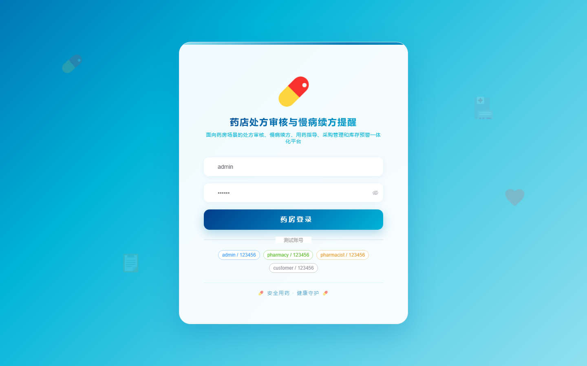

# 196 - 药店处方审核与慢病续方提醒管理系统

## 项目信息

- 项目编号：`196`
- 组件类型：`backend, frontend`
- 后端入口：`http://127.0.0.1:8196`
- 前端入口：`http://127.0.0.1:3196`
- 账号来源：未识别
- 已收录截图：`16` 张

## 默认账号

- 暂未自动识别到默认账号

## 预览截图

### guest

#### guest-01-dashboard

#### guest-01-login

#### guest-02-register

#### guest-02-user

#### guest-03-store

#### guest-04-customer

#### guest-05-medicine

#### guest-06-prescription

#### guest-07-review

#### guest-08-risk

#### guest-09-purchase

#### guest-10-guide

#### guest-11-plan

#### guest-12-reminder

#### guest-13-followup

#### guest-14-log

