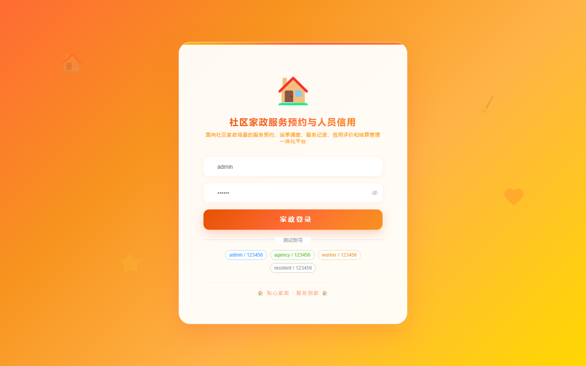
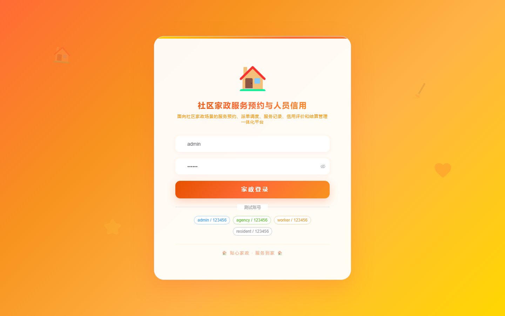
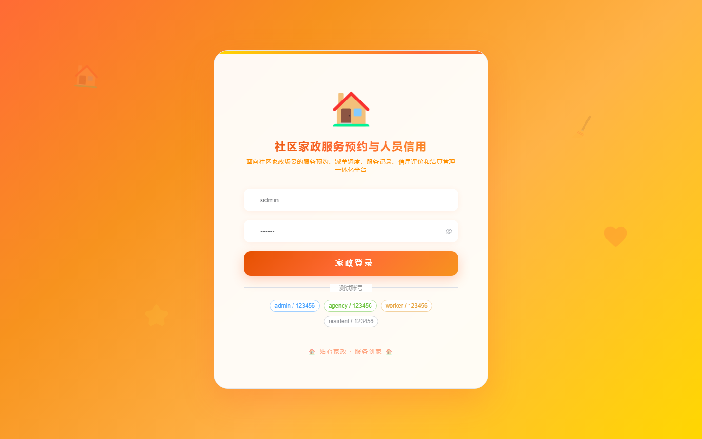

# 197 - 社区家政服务预约与人员信用评价系统

## 项目信息

- 项目编号：`197`
- 组件类型：`backend, frontend`
- 后端入口：`http://127.0.0.1:8197`
- 前端入口：`http://127.0.0.1:3197`
- 账号来源：未识别
- 已收录截图：`16` 张

## 默认账号

- 暂未自动识别到默认账号

## 预览截图

### guest

#### guest-01-dashboard

#### guest-01-login

#### guest-02-register

#### guest-02-user

#### guest-03-station

#### guest-04-resident

#### guest-05-worker

#### guest-06-service

#### guest-07-booking

#### guest-08-review

#### guest-09-dispatch

#### guest-10-record

#### guest-11-evaluation

#### guest-12-complaint

#### guest-13-settlement

#### guest-14-log

